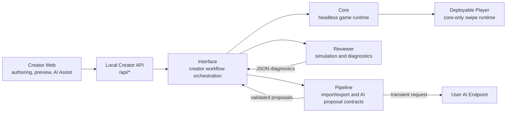
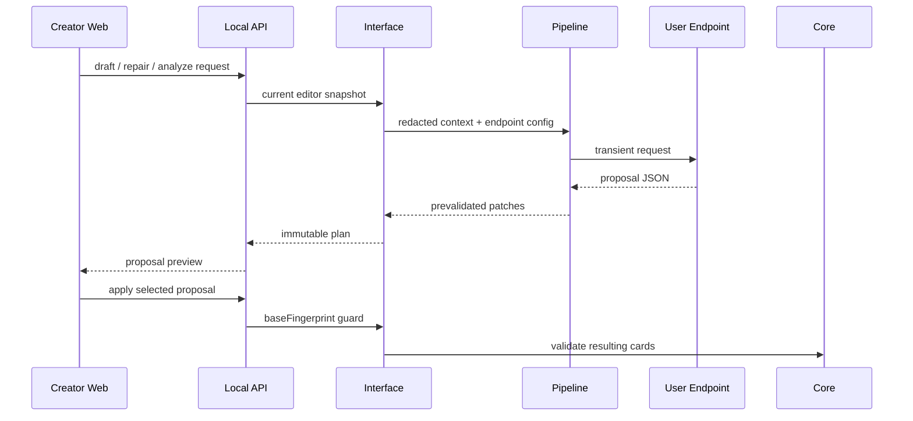

# ReignsAgent

<p align="center">
  
</p>

<p align="center">
  
</p>

ReignsAgent is a production-oriented creator tool for building Reigns-like card narratives. It gives authors and AI-assisted workflows a structured way to import content, edit cards, organize story progression, preview gameplay, run diagnostics, and prepare deployable player builds.

The player experience stays simple: one card, two choices, four default gauges, and pure left/right interaction. Story progression is expressed through author-owned data such as tags, variables, requirements, metadata, chapters, themes, arcs, and endings.

## Features

- **Creator workspace** for importing, editing, reviewing, previewing, and building card narratives.
- **Headless runtime** for deterministic Reigns-style play sessions.
- **Narrative diagnostics** through Monte Carlo simulation and graph reachability checks.
- **Data-driven story structure** with tags, variables, requirements, story groups, endings, i18n, and presentation metadata.
- **AI Assist workflow** for user-supplied endpoints, draft proposals, review repair, and visual request previews.
- **Deployable player output** with a standalone `player.html`, stitched runtime, content bundle, and static assets.

## What ReignsAgent Is Not

ReignsAgent does not ship built-in equipment, pets, inventory, shops, rarity, crafting, classes, skill trees, loot, or resource-management systems. Those ideas can appear only as user-authored labels or story text inside content. The built-in player model remains a binary card-swipe experience.

AI Assist is a creator-side workflow. Deployable player builds do not include provider SDKs, API keys, network AI calls, generated-edit tooling, or AI-specific gameplay behavior.

## Quick Start

```sh
npm install
npm run verify
```

Start the local creator stack:

```sh
npm run dev:interface
npm run dev:dashboard
```

Open:

- Creator Workbench: `http://127.0.0.1:5173/workbench`
- Preview Player: `http://127.0.0.1:5173/play`
- Local API: `http://localhost:4321/api/editor`

## Common Commands

```sh
npm test
npm run build:dashboard
npm run build:game -- fixtures/content/oss-court.cards.json dist/player
npm run content:validate -- fixtures/content/minimal.cards.json
npm run content:review -- fixtures/content/minimal.cards.json --cycles 100 --maxTurns 20
npm run content:convert -- fixtures/content/minimal.cards.json tmp.cards.csv
npm run content:feedback -- review-report.json
```

## Creator Workflow

The main UI lives in `apps/creator-web`.

| Area | Purpose |
| --- | --- |
| Overview | Project health, card count, validation state, player readiness, review state, and build status. |
| Content | Import content bundles, edit cards, tune choices, update gauge effects, manage tags/variables, and bind art. |
| Story | Inspect card reachability, left/right transitions, story groups, endings, graph issues, and reviewer heat. |
| Review | Run narrative QA for balance, pacing, coverage, unreachable paths, endings, and story group health. |
| AI Assist | Configure a user-supplied endpoint and produce reviewable draft, repair, story, and visual proposals. |
| Preview | Play a Reigns-style local session using keyboard, pointer drag, touch, or buttons. |
| Build | Prepare deployable `.game.json` and player assets. |
| Settings | Configure creator skin, AI endpoint protocol, model id, capability flags, and route compatibility. |

Workbench URLs preserve panel state, such as `/workbench/content`. Skin state is shared through query parameters such as `?skin=github-light`, `?skin=catppuccin-latte`, or `?skin=classic`; preview player pages accept the same `skin` query.

## Architecture



| Package | Role |
| --- | --- |
| `packages/core` | Pure headless runtime. No UI, IO, AI, reviewer, pipeline, or deployment code. |
| `packages/reviewer` | Monte Carlo simulation, graph diagnostics, narrative coverage, and balance reports. |
| `packages/pipeline` | Local import/export, content bundles, AI request contracts, and reviewer feedback actions. |
| `packages/interface` | Creator workflow orchestration, local web surfaces, and deployable player templates. |
| `apps/creator-web` | Vite/React creator workspace. |

## Content Model

Cards and metadata drive the game:

- `requirements.tags` gates cards on acquired or missing tags.
- `requirements.variables` gates cards on exact variable values.
- `requirements.factions` gates cards on `gauge0`, `gauge1`, `gauge2`, and `gauge3` using `min`, `max`, or `equals`.
- `choices[].effects.tags` sets or clears tags after a choice.
- `choices[].effects.variables` changes low-level variable state.
- `choices[].effects.factions` changes the default four gauges.
- `metadata.story.groups` describes chapters, themes, arcs, endings, or other authoring groups.
- `metadata.presentation.gauges` renames, describes, or hides the default gauge displays.
- `metadata.i18n` and card-level `i18n` provide localized card text and choice labels.

Legacy `faith`, `people`, `military`, and `treasury` keys are accepted on import and normalized to neutral `gauge0` through `gauge3` slots.

## AI-Assisted Creation

ReignsAgent is designed to work well with AI systems that generate or repair content, but AI output should remain reviewable.

For content work, an AI assistant should:

- Keep playable cards binary: exactly one left choice and one right choice.
- Use tags, variables, requirements, story groups, and endings for progression.
- Use only the default four gauge slots for built-in balance.
- Return explicit proposals or patches rather than silently mutating authored content.

For code work, an AI assistant should:

- Keep core runtime changes headless and deterministic.
- Keep endpoint calls and prompt/proposal handling in creator-side workflows.
- Keep deployable player output free of credentials, provider SDKs, network AI calls, and editor-only tooling.
- Run `npm run verify` before treating changes as ready.

## AI Endpoint Flow



## Build Output

```sh
npm run build:game -- fixtures/content/oss-court.cards.json dist/player
```

The build emits:

- `*.game.json` - deployable content bundle.
- `player.html` - standalone player page.
- `player-runtime.js` - player runtime with stitched core logic.
- `assets/logo-alpha.png` - transparent product logo.
- Local content assets referenced by the bundle, such as `assets/sample/*.svg`.

## API Examples

### Core Runtime

```js
import { createRuntime, restoreState } from "@reigns-agent/core";

const runtime = createRuntime({ cards, rng: () => 0 });
const result = runtime.step("accept");
const snapshot = runtime.snapshot();

const restored = createRuntime({
  cards,
  state: restoreState(snapshot),
  rng: () => 0
});

console.log(result.event, restored.events);
```

### Reviewer

```js
import { runMonteCarloReview, runSimulationCycle } from "@reigns-agent/reviewer";

const cycle = runSimulationCycle({
  cards,
  seed: 7,
  maxTurns: 20,
  includeEvents: true
});

const report = runMonteCarloReview({
  cards,
  cycles: 1000,
  maxTurns: 50,
  sampleLimit: 3,
  thresholds: { dominantGameOverRate: 0.45 }
});

console.log(cycle.terminalReason, report.diagnostics.warnings);
```

### Pipeline

```js
import {
  buildCardGenerationRequest,
  createDiagnosticFeedback,
  parseContentJson,
  stringifyContentJson
} from "@reigns-agent/pipeline";

const bundle = parseContentJson(sourceText);
const request = buildCardGenerationRequest({
  theme: bundle.metadata.title ?? "untitled",
  count: 8,
  diagnostics: reviewerReport
});
const feedback = createDiagnosticFeedback(reviewerReport);

console.log(request.requestId, feedback.actions, stringifyContentJson(bundle));
```

### Interface

```js
import {
  createCardEditor,
  createPlaySession,
  prepareGameBuild,
  runDiagnostics
} from "@reigns-agent/interface";

const editor = createCardEditor({ cards, metadata: { title: "Small Court" } });
const diagnostics = runDiagnostics({ cards: editor.toCards(), cycles: 1000, maxTurns: 50 });
const session = createPlaySession({ cards: editor.toCards(), rng: () => 0 });

session.start();
session.swipe("left");

const build = prepareGameBuild({ editor, buildId: "small-court-preview" });

console.log(diagnostics.healthScore, session.factions, build.player.choiceModel);
```

## Repository Layout

| Path | Purpose |
| --- | --- |
| `apps/creator-web` | Creator dashboard workspace. |
| `packages/core` | Headless game runtime. |
| `packages/reviewer` | Simulation and diagnostic engine. |
| `packages/pipeline` | Content exchange and AI proposal contracts. |
| `packages/interface` | Creator orchestration and player build assembly. |
| `scripts` | Dev server, content CLI, build-game assembler, and verification gates. |
| `fixtures` | Sample and validation content. |
| `test` | Cross-package integration tests. |

## Development Checks

Before treating a change as ready:

```sh
npm run verify
```

For deployable player changes:

```sh
npm run build:game -- fixtures/content/oss-court.cards.json <temporary-output-dir>
```
