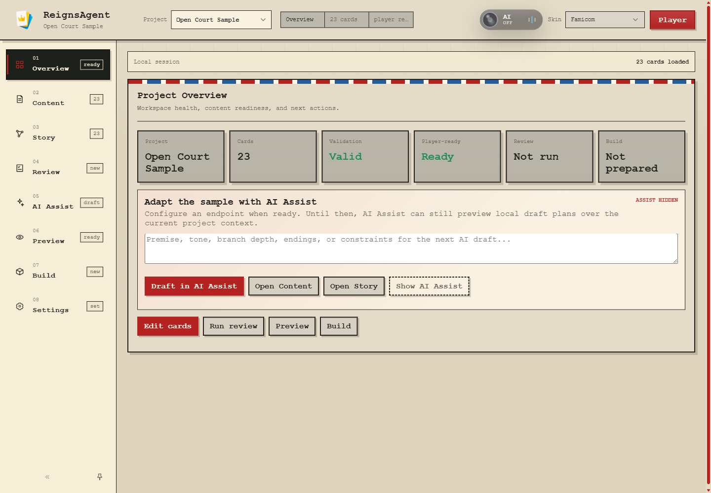
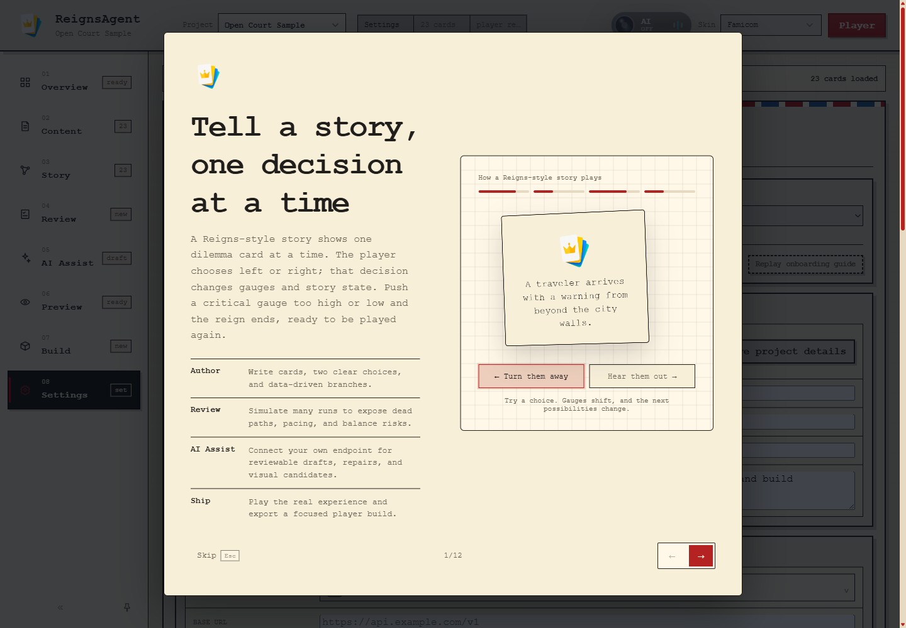
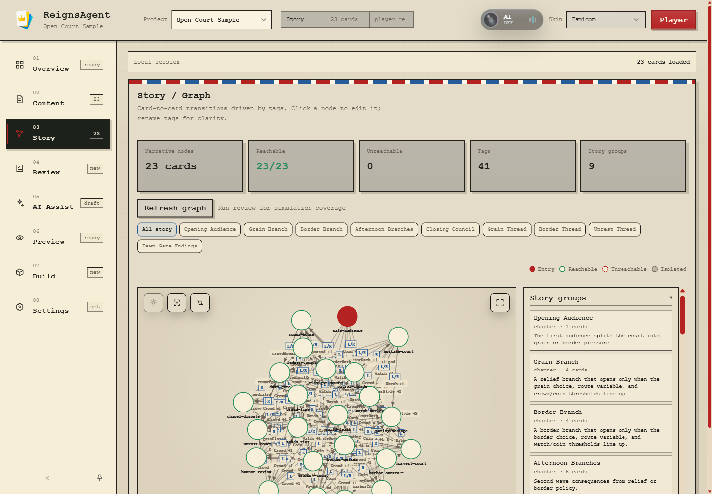
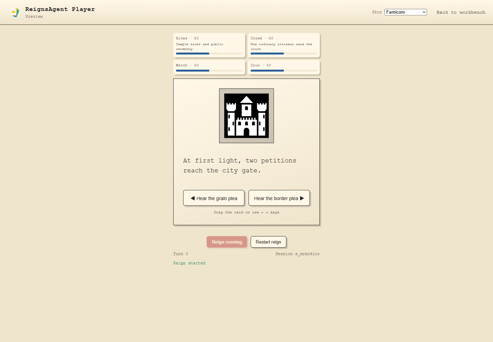
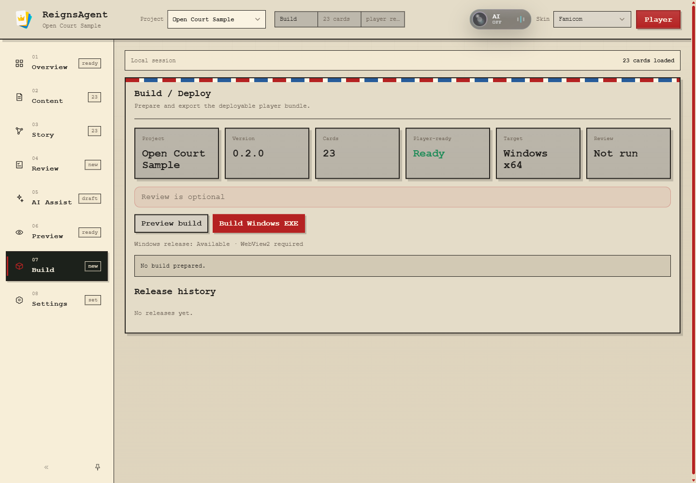
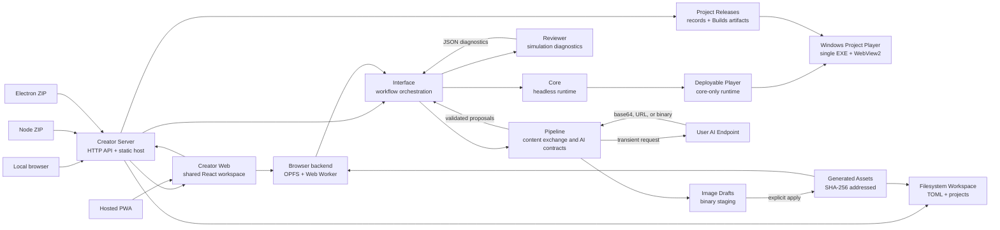
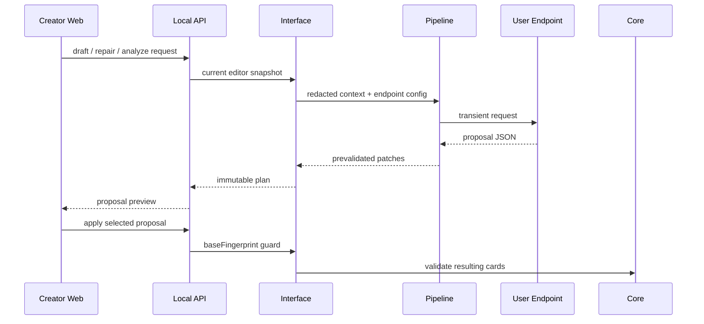

# ReignsAgent

<p align="center">
  
</p>

<p align="center">
  
  
</p>

<p align="center">
  English | <a href="README_zh-CN.md">简体中文</a>
</p>

ReignsAgent is a modular authoring, validation, and publishing stack for [Reigns](https://www.devolverdigital.com/games/reigns)-like card narratives. It combines a creator workbench, a deterministic headless runtime, simulation-based diagnostics, content import/export tooling, and a deployable player build path.

The project is built for two primary audiences: creators who need a practical workspace for narrative card production, and AI-assisted workflows that need clear contracts for drafting, repairing, validating, and shipping content without crossing runtime boundaries.

## Contents

- [Start Here: Choose And Use A Client](#start-here-choose-and-use-a-client)
- [Learn The Product Through Onboarding](#learn-the-product-through-onboarding)
- [Capabilities](#capabilities)
- [Design Boundaries](#design-boundaries)
- [Developer Quick Start](#developer-quick-start)
- [Creator Workflow](#creator-workflow)
- [Architecture](#architecture)
- [Content Model](#content-model)
- [AI-Assisted Workflows](#ai-assisted-workflows)
- [Build Output](#build-output)
- [Creator Distribution](#creator-distribution)
- [Package Examples](#package-examples)
- [Repository Layout](#repository-layout)
- [CI And Verification](#ci-and-verification)
- [Acknowledgements](#acknowledgements)
- [License](#license)

## Start Here: Choose And Use A Client

ReignsAgent has two kinds of application. **Creator** is the authoring workspace used to make, inspect, test, and publish projects. **Player** is the deliberately smaller application that runs one published project and exposes only the left/right game experience. A Player build cannot edit its own content, run reviews, or connect to an AI endpoint.

Most release users should download a portable desktop Creator ZIP. The other clients exist for zero-install browser use, a system-Node workflow, development, and deployment-specific needs.

| Client | Best for | Installation and storage | Important trade-offs |
| --- | --- | --- | --- |
| **Portable desktop Creator** | Most creators; offline local work | Extract the platform ZIP and run `ReignsAgent`. No system Node.js or installer is required. `ReignsAgentData` stays beside the extracted application. | Unsigned in v0.1.0; the operating system may show a warning. Keep the application and `ReignsAgentData` together when moving or backing it up. |
| **Local Node Creator** | Server-style local use and users who already have Node.js | Extract `reigns-agent-<version>.zip`, install Node.js 22+, then run `node start.mjs`. It opens the Creator in the default browser and stores data beside the archive. | A terminal process remains open while Creator is running. |
| **Hosted PWA** | Evaluation, Chromebook-style use, or a static deployment | Open the hosted URL in current Chrome or Edge. Projects are stored in origin-scoped browser storage and the app can reopen offline after a successful first load. | Clearing site data or changing the origin selects a different workspace. Export backups regularly. AI endpoints must support browser CORS and HTTPS. |
| **Source checkout** | Contributors and integrators | Run the Creator Server and Vite client from this repository. The default development workspace is `.reigns-agent-data/`. | Requires Node.js 22+, npm dependencies, and two development processes. |
| **Published Player** | People playing a finished project | Open the exported Web Player or the project-specific Windows EXE supplied by its author. | It is intentionally not a Creator client and never contains Creator, Reviewer, Pipeline, endpoint settings, or credentials. |



_The Creator overview is the hand-off point between project setup, card editing, review, preview, and release. The screenshots in this guide use the bundled Open Court sample and the Famicom skin; content and appearance are project/client choices._

### Launch A Release Build

The [Releases](https://github.com/Sisyphe42/ReignsAgent/releases) page contains five Creator archives plus `SHA256SUMS.txt`:

| Download | Target | Start it after extraction |
| --- | --- | --- |
| `ReignsAgent-win32-x64-<version>.zip` | Windows 10/11 x64 | Run `ReignsAgent.exe`. |
| `ReignsAgent-darwin-arm64-<version>.zip` | Apple Silicon macOS | Open `ReignsAgent.app`. |
| `ReignsAgent-darwin-x64-<version>.zip` | Intel macOS | Open `ReignsAgent.app`. |
| `ReignsAgent-linux-x64-<version>.zip` | Linux x64 | Run the `ReignsAgent` executable. |
| `reigns-agent-<version>.zip` | Any platform with Node.js 22+ | Run `node start.mjs`; Windows also includes `start.cmd`, and macOS/Linux include `start.sh`. |

Do not run the application from inside the ZIP. Extract it into a writable directory first so the portable `ReignsAgentData` workspace can be created beside it. Desktop archives are unsigned: Windows SmartScreen, macOS Gatekeeper, or Linux desktop policy may ask you to confirm the first launch. The current release has no installer, automatic updater, code signing, or notarization.

Verify the downloaded archive before extraction:

```sh
# macOS/Linux, from the directory containing the ZIP and SHA256SUMS.txt
sha256sum -c SHA256SUMS.txt --ignore-missing
```

```powershell
# Windows PowerShell: compare the result with the matching SHA256SUMS.txt line
Get-FileHash .\ReignsAgent-win32-x64-0.1.0.zip -Algorithm SHA256
```

The desktop Creator starts its shared local server automatically and opens `/workbench` inside the application window. The Node Creator prints its loopback address, normally `http://127.0.0.1:4321/workbench`, and opens that address in the default browser. Closing the desktop window stops its server; stop the Node Creator with `Ctrl+C`.

### Learn The Product Through Onboarding

The onboarding guide is a 12-step, localized walkthrough of the actual Creator rather than a separate tutorial project. Its first screen explains the Reigns-style loop with an interactive left/right dilemma; the remaining spotlight steps move through the live workspace:

| Steps | What the guide introduces |
| --- | --- |
| Introduction | One card, two decisions, four gauges, story-state changes, and what ends a reign. |
| Project → Content → Story | Starting from a blank or cloned sample project, authoring binary choices, and reading tag-driven narrative structure. |
| Review → AI Assist | Reproducible simulation diagnostics and controlled, reviewable AI proposals. |
| Preview → Build → Player | Playing with the production rules, checking release readiness, and separating the player-only surface from Creator. |
| Settings → GitHub → Replay | Workspace preferences and persistence, project documentation, releases, issue tracking, and where to restart the tour. |



The guide starts automatically only on the first ordinary `/workbench` visit for the current client. An explicit deep link such as `/workbench/content` wins over onboarding so shared links remain deterministic. Completion is stored in guarded client-local storage: **Finish**, **Skip**, or `Esc` suppresses the next automatic launch, while unavailable or throwing `localStorage` falls back safely and does not block Creator startup.

Use the on-screen arrows, `Left`/`Right`, or `Space` to move between steps; `Esc` exits. The introductory card remains interactive, while later targets are highlighted without triggering editor, AI, Review, or Build actions. When the guide changes panels it restores the panel from which the tour began when closed, and it never changes projects or shared settings. Open **Settings → Guidance → Replay onboarding guide** at any time to start again immediately.

### Create Or Open Your First Project

Use the **Project** menu in the top bar to choose one of these starting points:

1. **New from sample** clones the bundled Open Court sample into an editable project. This is the recommended first run because it demonstrates branching requirements, story groups, localized content, custom gauge labels, art bindings, endings, and a player-ready deck.
2. **New blank project** creates an empty project for original work.
3. **Import project** in **Content** imports a project/content bundle from a local file. The Hosted PWA also exposes workspace and active-project ZIP import/export under **Settings → Browser Persistence**.
4. Selecting an existing project switches the active workspace. Deletion is project-scoped and requires confirmation.

The bundled sample itself is immutable; **New from sample** creates an ordinary editable copy. The title shown in the top bar and releases comes from `content.json.metadata.title`, while author, description, links, version, localization, and gauge presentation remain project-authored metadata.

### Complete One Creator Workflow

The numbered rail is ordered as a practical production loop. You can move freely between panels, but a first project is easiest to understand in this order.

#### 1. Author Cards In Content

Open **Content** to import a bundle, search and filter the deck, add or select a card, and edit the dilemma text. Every playable card has exactly one left choice and one right choice. Choice effects can change the four gauge slots and set author-owned tags or variables; requirements decide when a card is eligible. Use the author summary above the fields to inspect the current gate and both outcomes before changing low-level values.

Save actions validate the edited shape before it becomes the current project state. A card marked **player-ready** satisfies the Player contract; invalid cards remain visible to the author but block a release. Use assets relative to the project, and confirm art bindings in Preview rather than relying on a file name alone.

#### 2. Inspect Narrative Structure In Story

Open **Story** after the first branch exists. The graph projects card-to-card possibilities from requirements and effects; its summary distinguishes reachable, unreachable, and isolated cards. Story groups can label chapters, themes, arcs, or endings without adding built-in gameplay systems. Click a graph node to return to its card, filter by a story group to isolate a thread, and rename tags carefully because they connect authored state across multiple cards.



Graph reachability is structural. It tells you whether a path can exist, not how often a player will see it. **Review** adds simulation evidence: run it after meaningful content changes, then inspect coverage, pacing, endings, dead paths, gauge pressure, and story-group health. Review findings are diagnostics, not automatic edits; return to Content or Story to make deliberate changes and rerun the review.

#### 3. Use AI Assist As An Optional Proposal Layer

AI Assist is an optional Creator-side collaboration layer, not an autonomous author and not part of the game runtime. Turning on the AI control exposes contextual actions around the current Overview, card, Story selection, or Review finding. Without an endpoint it can still assemble and preview a local request plan; with a configured endpoint it executes that plan and returns proposals for inspection.

| Workflow | Input and result |
| --- | --- |
| Project or card drafting | Combines the current project snapshot with a premise, tone, branch depth, ending goal, constraints, target card, and requested card count. The endpoint returns explicit patch proposals rather than a replacement project. |
| Review repair | Requires a completed Review result, targets the selected diagnostic and affected cards, and proposes the smallest relevant repair. Rerun Review after applying changes to measure the result. |
| Context actions | Explain, translate, or branch from the selected card/graph context while preserving ids, tags, variables, and left/right meaning unless the instruction explicitly changes them. |
| Visual generation | Generate new art or, when the chosen adapter supports it, use reference images, edit, inpaint, outpaint, masks, aspect ratios, negative prompts, and multiple output candidates. Results remain binary drafts until applied. |

Text endpoint configuration lives under **Settings → AI Endpoint**. Choose a channel preset or custom endpoint, supply the base URL and model ID, declare capabilities such as structured JSON or vision, then use the advanced controls only when protocol, route, compatibility, or JSON-mode overrides are needed. **Fetch `/models`** queries compatible model discovery routes. **Validate endpoint** sends a compatibility request and does not edit the project.

Image configuration is independent under **Settings → Image Endpoint**, but it may inherit the text credential. First-party adapters cover OpenAI Images-compatible routes, Gemini Interactions, Stability Stable Image, and Midjourney Proxy/NewAPI. Creator shows only the operations and parameters advertised by the selected adapter; validating image configuration does not start a paid generation.

Building a text plan captures a fingerprint of the current content. Inspect each proposal summary and JSON patch, select only the proposals you want, and choose **Apply selected**. If the project changed since the plan was built, the stale-plan guard rejects it and requires a new plan. Patch prevalidation and Player validation still apply. For images, choose one generated result and **Apply selected image** to commit a content-addressed local asset and optionally bind it to a card; **Discard draft** removes the staged candidate. Neither text nor image output silently becomes authored or published content.

Local and desktop clients call endpoints through the Creator Server. Hosted calls them directly from the browser, so the endpoint must allow the Creator origin, `Authorization`, and `Content-Type` through CORS; an HTTPS Creator also requires an HTTPS endpoint except for localhost. ReignsAgent does not operate an AI relay.

Saved local endpoint keys are plaintext local configuration by product choice, masked in the interface, and excluded from Player builds, logs, and ordinary project exports. Hosted backup export excludes the plaintext key by default and requires an explicit confirmation to include it. Never put a private key in a `VITE_*` build variable.

#### 4. Preview The Actual Choice Loop

Use **Preview** for an embedded session or the top-right **Player** button for the dedicated Player page. Start a reign, then choose by clicking the left/right decree, pressing the arrow keys, dragging with a pointer, or swiping on touch. Watch the gauge response and subsequent card selection. Reaching a critical gauge ends the current reign and offers an immediate restart.



The Player link carries the current skin, interface locale, desktop marker, and return context. A published Player has its own appearance, language, game-record, and about controls, but no authoring surface. Always test the dedicated Player before publishing because it is closer to the shipped experience than reading card JSON or using only the embedded preview.

#### 5. Prepare And Publish

Open **Build** when every card is player-ready. **Preview build** validates and assembles the deployable content/runtime boundary. Running Review first is recommended, but Player validation is the release blocker.



Output depends on the client:

| Creator host | Publish path |
| --- | --- |
| Local Node or desktop Creator on Windows x64 | **Build Windows EXE** creates or reuses a deterministic project release and records it in release history. The target machine needs Windows 10/11 x64 and Microsoft Edge WebView2 Evergreen Runtime. |
| Hosted PWA | Export a Web Player ZIP assembled in the browser. |
| Source or extracted Node distribution on any supported platform | Run `npm run build:game -- <content.json> <output-dir>` in a checkout, or `node scripts/build-game.mjs <content.json> <output-dir>` in the Node distribution, to create a static Player site. |

Windows project EXEs are unsigned in v0.1.0 and contain only the project bundle, Player assets, stitched Core runtime, and restricted native host. They do not contain Creator Web, Creator Server, Pipeline, Reviewer, AI connectors, endpoint settings, or credentials.

### Know Where Your Work Lives

| Client | Durable workspace | Backup and portability |
| --- | --- | --- |
| Portable desktop Creator | `ReignsAgentData/` beside the extracted application. | Move or copy the application and data directory together. Project releases are under `ReignsAgentData/Builds/<project-id>/`. |
| Local Node Creator | `ReignsAgentData/` beside the extracted Node distribution, unless `REIGNS_AGENT_DATA_ROOT` is set. | Stop the server before copying the directory. Workspace and project data use the same layout as desktop. |
| Source checkout | `.reigns-agent-data/` at the repository root by default, unless `REIGNS_AGENT_DATA_ROOT` is set. | Treat it as local runtime data, not source to commit. |
| Hosted PWA | Origin-scoped OPFS in the browser profile. | Use **Settings → Browser Persistence** to export a workspace backup or active-project ZIP. Clearing site data destroys the local workspace; a different scheme, host, or port is a different workspace. |
| Published Player | Browser/native local preferences and bounded play records only. | It does not own or modify the Creator project from which it was built. |

For repository contributors, this README owns product usage, release behavior, architecture, and verification entry points. Durable implementation boundaries, agent conduct, Git policy, and change-specific test requirements live in [AGENTS.md](AGENTS.md); read both before changing the system.

## Capabilities

| Area | Scope |
| --- | --- |
| Creator workbench | Manage projects, import, edit, review, preview, configure AI Assist, and prepare builds from one responsive workspace with English and Simplified Chinese UI. |
| Core runtime | Deterministic headless play sessions with four default gauges, card scheduling, choices, game-over detection, snapshots, restore, and event logs. |
| Reviewer | Monte Carlo simulation, graph reachability, coverage diagnostics, pacing checks, endings analysis, and balance warnings. |
| Pipeline | JSON/CSV/content-bundle exchange, text and image endpoint adapters, capability negotiation, patch prevalidation, and reviewer feedback actions. |
| Deployable player | Standalone player assets built from validated content and core runtime code only. |
| AI Assist | User-supplied endpoint workflow for draft proposals, review repair, story edits, image generation/edit/inpaint/outpaint drafts, and explicit apply. |

## Design Boundaries

ReignsAgent keeps the player model deliberately small: one active card, two choices, four default gauges, and pure left/right interaction. Narrative progression is expressed through author-owned data such as tags, variables, card requirements, metadata, story groups, arcs, endings, i18n, and presentation configuration.

The product does not ship built-in equipment, pets, inventory, shops, rarity, crafting, classes, skill trees, loot, or resource-management systems. Those concepts can appear as story text or user-defined labels in content, but they are not built-in gameplay loops or product features.

AI Assist is creator-side tooling. Deployable player builds do not include provider SDKs, API keys, network AI calls, generated-edit tooling, or AI-specific gameplay behavior.

## Developer Quick Start

Install dependencies and run the full verification gate:

```sh
npm install
npm run verify
```

Start the local creator stack:

```sh
npm run dev:interface
npm run dev:dashboard
```

Open the local surfaces:

| Surface | URL |
| --- | --- |
| Creator Workbench | `http://127.0.0.1:5173/workbench` |
| Preview Player | `http://127.0.0.1:5173/play` |
| Local API | `http://localhost:4321/api/editor` |

Common project commands:

```sh
npm test
npm run build:dashboard
npm run dev:hosted
npm run build:hosted
npm run build:game -- fixtures/content/oss-court.cards.json dist/player
npm run build:release
npm run test:desktop
npm run test:desktop:packaged
npm run build:desktop
npm run content:validate -- fixtures/content/minimal.cards.json
npm run content:review -- fixtures/content/minimal.cards.json --cycles 100 --maxTurns 20
npm run content:convert -- fixtures/content/minimal.cards.json tmp.cards.csv
npm run content:feedback -- review-report.json
```

## Creator Workflow

The main authoring UI lives in `apps/creator-web`.

| Workspace area | Purpose |
| --- | --- |
| Overview | Project health, card count, validation state, player readiness, review status, and build status. |
| Content | Content-bundle import, card editing, left/right choice tuning, gauge effects, tags, variables, and art bindings. |
| Story | Reachability, left/right transitions, story groups, endings, graph issues, and reviewer heat. |
| Review | Narrative QA for balance, pacing, coverage, unreachable paths, endings, and story group health. |
| AI Assist | User endpoint configuration plus reviewable text proposals and generated image candidates with explicit apply/discard. |
| Preview | Local Reigns-style play sessions using keyboard, pointer drag, touch, or buttons. |
| Build | Deployable `.game.json` and player asset preparation. |
| Settings | Creator skin, interface language, onboarding replay, endpoint protocol, model id, capability flags, route compatibility, and product About information. |

Workbench URLs preserve panel state, for example `/workbench/content`. Skin state is shared through query parameters such as `?skin=github-light`, `?skin=catppuccin-latte`, and `?skin=classic`; preview player pages accept the same `skin` query.

An explicit `/workbench/<panel>` URL takes precedence over the last panel stored in the project workspace, so deep links remain deterministic. On wide screens the navigation rail supports pinned expanded, pinned icon-only, and unpinned hover/focus-reveal modes; narrow screens retain the full horizontal tab strip. Electron additionally enables `Ctrl+Tab`, `Ctrl+Shift+Tab`, and `Ctrl+1` through `Ctrl+8`. Rail density and pinning remain local to each client, while the interface locale is shared through workspace configuration. Opening the Player carries the selected skin, locale, and desktop marker; its back link preserves that context while the project workspace restores the last active panel.

The first ordinary `/workbench` visit on each client starts an English or Simplified Chinese tour of the complete Creator workflow. It opens with a split-screen introduction for people unfamiliar with Reigns-style play: one dilemma card, one left/right decision, resulting gauge and story-state changes, and a new reign after a critical gauge ends the run. The interactive demo leads into concise spotlight steps over authoring, simulation review, controlled AI drafts and visual candidates, preview, release, and the player-only surface. The penultimate step highlights About and its GitHub link for deeper documentation before Settings shows where to replay the guide. The tour changes panels only for presentation, restores the starting panel when closed, and never runs editor, AI, review, or build actions. Completing, skipping, or pressing Escape suppresses future automatic launches through exception-safe client-local storage; explicit panel deep links and clients without usable `localStorage` never auto-launch it. Settings can replay the guide immediately without changing projects or shared configuration.

## Architecture



The Creator UI has two host adapters. Local Web, Node ZIP, and Electron use `HttpCreatorBackend` over the shared Creator Server and filesystem Workspace. The hosted PWA uses `BrowserCreatorBackend`; browser APIs and the OPFS adapter stay in `apps/creator-web`, while `packages/workspace` remains host-neutral. Hosted diagnostics run in a Web Worker and user AI endpoints are called directly. Image responses are localized immediately, staged as binary drafts, and only enter authored content after explicit apply; committed files use `assets/generated/<sha256>.<ext>`. Neither adapter changes Core or player runtime contracts.

| Layer | Responsibility |
| --- | --- |
| `packages/core` | Headless deterministic runtime. No UI, IO, AI, reviewer, pipeline, or deployment code. |
| `packages/reviewer` | Simulation, graph diagnostics, narrative coverage, endings analysis, and balance reporting. |
| `packages/pipeline` | Content exchange, text proposal contracts, OpenAI Images-compatible/Gemini Interactions/Stability/Midjourney Proxy image adapters, capability negotiation, and feedback actions. |
| `packages/interface` | Creator workflow orchestration, local web surfaces, play-session helpers, diagnostics projection, and build assembly. |
| `apps/creator-web` | Vite/React creator workspace. |
| `apps/creator-server` | Shared HTTP/static host for local Web, Node ZIP, and Electron. |
| `apps/player-windows` | Native Win32/WebView2 host for Windows x64 Project player releases; no Creator product logic. |
| `packages/workspace` | Host-neutral configuration/project contracts and the Node filesystem adapter. |
| `apps/desktop-electron` | Sandboxed portable lifecycle shell; no Creator business logic. |

## Content Model

Cards and metadata are the product contract.

| Field | Role |
| --- | --- |
| `requirements.tags` | Gate cards on acquired or missing tags. |
| `requirements.variables` | Gate cards on exact variable values. |
| `requirements.factions` | Gate cards on `gauge0`, `gauge1`, `gauge2`, and `gauge3` with `min`, `max`, or `equals`. |
| `choices[].effects.tags` | Set or clear tags after a choice. |
| `choices[].effects.variables` | Change low-level variable state after a choice. |
| `choices[].effects.factions` | Change the default four gauges. |
| `metadata.story.groups` | Describe chapters, themes, arcs, endings, or other authoring groups. |
| `metadata.presentation.gauges` | Rename, describe, or hide the default gauge displays. |
| `metadata.i18n` and card-level `i18n` | Provide localized card text and choice labels. |

Legacy `faith`, `people`, `military`, and `treasury` keys are accepted on import and normalized to neutral `gauge0` through `gauge3` slots.

## AI-Assisted Workflows

ReignsAgent is designed to work with AI systems as controlled collaborators. AI output should be explicit, reviewable, and validated before it becomes authored content.

Image Endpoint settings are independent from the text endpoint, but may inherit its connection credentials. The first-party adapters expose only the operations and parameters they support: OpenAI Images-compatible routes use JSON generation and multipart edit requests, Gemini Interactions uses JSON plus inline image blocks, Stability Stable Image uses operation-specific multipart routes, and Midjourney Proxy/NewAPI submits asynchronous Imagine tasks and polls them to completion. Midjourney exposes Generate and reference Edit in Creator; task-context operations such as mask edits and outpaint remain hidden. Generate, Edit, Inpaint, and Outpaint produce local draft candidates where supported; Apply commits the selected candidate and binds it to a card or saves it as an unbound asset, while Discard removes the draft. Remote result URLs are downloaded before a response is returned and are never stored in project content.

For content generation or repair:

- Keep playable cards binary: exactly one left choice and one right choice.
- Use tags, variables, requirements, story groups, and endings for progression.
- Use only the default four gauge slots for built-in balance.
- Return proposals or patches that can be reviewed and applied deliberately.

Implementation and review rules for code changes are maintained in [AGENTS.md](AGENTS.md). The architecture section below explains the same boundaries from a product and contributor perspective without duplicating the agent workflow policy.

### Endpoint Proposal Flow



## Build Output

Build a deployable player from a content bundle:

```sh
npm run build:game -- fixtures/content/oss-court.cards.json dist/player
```

The build emits:

| Output | Description |
| --- | --- |
| `*.game.json` | Deployable content bundle. |
| `player.html` | Standalone player page. |
| `player-runtime.js` | Player runtime with stitched core logic. |
| `assets/logo-alpha.png` | Transparent product logo. |
| Local content assets | Assets referenced by the bundle, such as `assets/sample/*.svg`. |

### Windows Project Release

On Windows x64, the local Node Creator and Electron Creator can publish the active Project from **Build / Deploy** as one directly launchable EXE. Player validation is required; running Review is recommended but does not block publishing. Hosted Creator continues to export the Web Player ZIP.

The EXE contains the active `.game.json`, standalone player page, stitched Core/player runtime, default icon, and referenced player assets. It never contains Creator Web, Creator Server, Pipeline, Reviewer, AI connectors, endpoint settings, or credentials. The native host validates the versioned payload bounds and SHA-256 hashes before extracting read-only web resources to a temporary directory, then serves them through a restricted WebView2 virtual host. In-view external navigation, permissions, downloads, developer tools, and default context menus are disabled; authored HTTP(S) links opened in a new window are handed to the system browser.

The release player has its own presentation surface rather than reusing the Creator preview: a responsive decision stage, reliable directional card-and-seal transitions, clickable left/right decrees, keyboard and drag input, live gauge feedback, and an immediate one-click restart. Full card motion is the deterministic default and an explicit reduced-motion preference is available in Appearance. Its Appearance drawer consumes the same canonical Skin catalog and semantic theme tokens as Creator, with player-specific compositions for skins such as Famicom and Phantom. The Game record groups a bounded, build-scoped history by local `Reign XX` play session, while Language switches authored card and choice translations through `metadata.i18n` without restarting the current reign. About presents project-authored title, version, author, and description plus one linked `Built with ReignsAgent` credit. Skin, motion, locale, and records survive relaunch; storage failures fall back without blocking play, and records can be explicitly cleared. The native window is per-monitor DPI-aware so controls remain correctly sized and hit-tested on scaled Windows displays. Authoring and editing remain Creator-only responsibilities.

Windows 10/11 x64 and an installed Evergreen WebView2 Runtime are required. The release does not bundle or download WebView2, is unsigned, and has no installer or automatic updater. Build the reusable native host and run the real release smoke test with:

```sh
npm run build:player:windows
npm run test:player:windows
```

Creator users do not need Visual Studio, Node.js, .NET, or Electron to publish: supported Creator distributions already stage the reusable host. Repository builders need Visual Studio 2022 C++ tools; the build script restores the pinned WebView2 SDK and statically links its Loader.

Release artifacts live under `ReignsAgentData/Builds/<project-id>/` as `<project-title>-<version>-<build-id>.exe`. Records live under the Project's `builds/` directory and contain the release ID, project/build IDs, title, version, `windows-x64` target, timestamp, relative artifact path, size, and SHA-256. The local API exposes:

| API | Behavior |
| --- | --- |
| `GET /api/releases` | Return the active Project's release history and Windows capability. |
| `POST /api/releases/windows-x64` | Validate the active Project and atomically create or reuse its deterministic build release. |
| `GET /api/releases/:id/artifact` | Download a size- and hash-verified EXE owned by the active Project. |
| `DELETE /api/releases/:id` | Delete the confirmed release record and EXE. |

## Creator Distribution

### Hosted PWA

Run the Creator without the local API:

```sh
npm run dev:hosted
npm run build:hosted
```

The output is `apps/creator-web/dist-hosted/`. Set `REIGNS_AGENT_BASE_PATH=/reignsagent/` when building for a reverse-proxy or static-host subpath; application URLs, manifest scope, Service Worker, and offline navigation use that prefix.

The repository-level `vercel.json` deploys this output at the Vercel domain root, forces `REIGNS_AGENT_BASE_PATH=/` so generated asset URLs match Vercel's static filesystem, and rewrites SPA deep links to `index.html`. Vercel projects should leave Root Directory at the repository root; the checked-in build command and output directory are authoritative.

Hosted projects and `config.toml` live in origin-scoped OPFS. Chrome and Edge are the supported v1 browsers. After the first successful load the PWA can reopen offline. Clearing site data destroys the workspace, and changing scheme, host, or port selects a different workspace, so Settings exposes persistence status plus Workspace ZIP and active-project ZIP export/import. Backups exclude the plaintext AI key by default; including it requires an explicit checkbox and confirmation.

Hosted navigation keeps Creator and Player as separate pages. The Player button opens the same shared `packages/interface/web/player.html` page used by local `/play`; its Hosted backend reads the active project from the same origin-scoped OPFS workspace. The Service Worker caches both the player page and the Creator app shell. When a same-scope navigation is offline or returns a non-success HTTP response, it falls back to the matching cached page, while direct workbench routes continue to open through `index.html`.

AI calls go directly to the configured endpoint. An HTTPS Creator requires an HTTPS endpoint, except localhost, and the endpoint must allow the Creator origin plus `Authorization` and `Content-Type` through CORS. ReignsAgent operates no relay. Browser player export downloads a locally assembled ZIP and excludes AI settings and credentials.

Server-side `.env` or process-environment credential loading belongs only to the local Creator Server and self-hosted server deployments. A hosted static build cannot read a private server `.env`; never expose secrets through `VITE_*` variables because those values are compiled into public browser assets. Each hosted user supplies their own endpoint and key in the browser workspace.

### Local Node ZIP

Build the complete local Creator distribution:

```sh
npm run build:release
```

This command runs the full verification gate, compiles the Creator, and emits both `dist/reigns-agent-<version>/` and `dist/reigns-agent-<version>.zip`. The ZIP is cross-platform and requires Node.js 22 or newer on the target machine; it does not bundle Node.js or `node_modules`.

After extracting the ZIP, start the Creator with one of these commands:

```sh
# All platforms
node start.mjs

# Windows convenience launcher
start.cmd

# macOS/Linux convenience launcher
sh start.sh
```

The launcher serves the compiled Creator, local API, and player preview from one process at `http://127.0.0.1:4321/workbench`, then opens the browser. Use `--no-open` to suppress browser launch, or set `HOST` and `PORT` to override the listener.

The distribution contains:

| Path | Purpose |
| --- | --- |
| `creator/` | Compiled Vite/React Creator application. |
| `apps/creator-server` | Shared local API and static application server used by CLI and packaged hosts. |
| `scripts/build-game.mjs` | Deployable standalone player builder. |
| `packages/*/src` | Runtime modules required by the local API and player builder. |
| `packages/interface/web` | Player preview and standalone player templates. |
| `fixtures/content` | Example content for evaluation and player builds. |
| `apps/player-windows/out/win-x64/ReignsAgentPlayer.exe` | Prebuilt native Project player host in Windows distributions. |
| `LICENSE.reigns-agent.txt` | ReignsAgent's MIT license, distinct from host-runtime licenses. |
| `THIRD_PARTY_NOTICES.md` | Notices for bundled frontend and player-host dependencies. |

The package intentionally excludes tests, frontend source, caches, `.env`, `node_modules`, and AI-specific player behavior. Creator state is stored beside the extracted package under `ReignsAgentData`; set `REIGNS_AGENT_DATA_ROOT` to override that location. To generate a player site from the extracted package, run:

```sh
node scripts/build-game.mjs fixtures/content/oss-court.cards.json output/player
```

Builds started through the packaged Creator default to `ReignsAgentData/Builds`, even when the launcher is invoked from another working directory. Explicit CLI output paths remain under caller control.

## Electron Desktop Host

Electron is an optional outer host over the same compiled Creator and local API used by the Node ZIP. The WebUI, API routes, Core, Pipeline, Reviewer, Interface, Workspace, and player builder remain shared; no product logic is implemented in Electron.

```sh
# Build Creator, stage the shared runtime, and launch Electron
npm run dev:desktop

# Run boundary tests plus a real utility-process/API smoke test
npm run test:desktop

# Run the full repository gate and make the current platform's portable ZIP
npm run build:desktop
```

The desktop app, window, executable, and metadata all use the product name `ReignsAgent`; package author metadata is `Sisyphe42`, matching the GitHub repository owner. It uses application ID `io.reignsagent.app`, starts the Creator Server in an Electron utility process on a random loopback port, and loads `/workbench` in a sandboxed BrowserWindow. The host marks that shared route as a desktop client so the Creator can enable desktop-only panel shortcuts (`Ctrl+Tab`, `Ctrl+Shift+Tab`, and `Ctrl+1` through `Ctrl+8`) without importing Electron APIs.

Creator navigation has independent density and anchoring controls on wide layouts: the arrow switches a pinned rail between full and icon-only sizes, while the pin switches between a fixed rail and an icon rail that temporarily reveals the full navigation on hover or keyboard focus. Narrow layouts keep the complete horizontal tab strip. Navigation preferences and onboarding completion are local to each client. The onboarding tour applies the same step-specific scroll behavior in both directions: panel headings and top-bar controls use the natural workspace start, while lower Settings targets scroll into a suitable centered position. It includes a dedicated Settings overview, supports Left/Right or Space navigation, and keeps Skip, progress, and arrow controls aligned left, center, and right along the guide footer. Its introductory choice demo continues to alternate under reduced-motion preferences while visual transitions are minimized. Interface language defaults to following the current browser or device, with explicit English and Simplified Chinese overrides stored in the shared workspace config so browser, local server, and desktop clients consume the same preference.

All Creator Electron targets are portable ZIP archives: Windows x64, macOS x64/arm64, and Linux x64. This ZIP-only rule applies to Creator distribution artifacts; an authored Project may be published separately as a single Windows x64 player EXE. Extract the Creator archive and run `ReignsAgent` directly; no installer or system Node.js is required. Electron profile data, `config.toml`, projects, and game exports stay beside the extracted app under `ReignsAgentData/`. On macOS, that directory is created beside `ReignsAgent.app`. Moving the app and its data together preserves the portable workspace.

The durable workspace layout is shared by Electron and the Node ZIP:

```text
ReignsAgentData/
  config.toml
  projects/<project-id>/
    project.toml
    content.json
    workspace.toml
    assets/
    reviews/
    builds/
  Builds/
    <project-id>/*.exe
```

`content.json.metadata.title` is the canonical project name; optional `author` and `description` fields provide release credits, and `titleUrl` / `authorUrl` may provide HTTP(S) links edited in Creator Settings. Project translations are authored data: `metadata.i18n` declares default/supported locales, while card and choice `i18n` entries supply localized text. Authors can provide them through imported JSON/content proposals; the bundled sample includes English and Simplified Chinese and its release player exposes a language switch. The bundled sample is immutable; choosing **Sample** clones it into an ordinary project. Global theme and text/image endpoint settings live in `config.toml`; project-local panel/selection state lives in `workspace.toml`. API keys are stored as plaintext in the local config by product choice, masked in the UI, and excluded from project/player exports and logs; API projections expose only `hasApiKey`.

`.github/workflows/desktop.yml` builds the Node Creator ZIP and all four native Electron ZIPs. A manual run smoke-tests and assembles the complete asset set without publishing. A matching `v*` tag additionally validates the tag against `package.json`, generates sorted `SHA256SUMS.txt`, and publishes only after every native job succeeds. Only that tag-gated publication job receives `contents: write`; it refuses to replace an existing release.

`test:desktop:packaged` runs after Electron Packager and verifies both the unpacked Creator Server runtime and the packaged executable handshake. `verify-desktop-artifacts` rejects installer formats, inspects ZIP contents, requires the project legal files, and excludes portable user data. Builders with an existing Electron ZIP may set `ELECTRON_ZIP_DIR` to its containing directory to avoid downloading the runtime again.

### Repository releases and checksums

Repository releases contain exactly five tested Creator ZIPs: the cross-platform Node distribution plus Windows x64, macOS x64, macOS arm64, and Linux x64 portable Electron distributions. Generated Project EXEs are authored outputs and are not published as a generic repository asset. Every ZIP contains `LICENSE.reigns-agent.txt` and `THIRD_PARTY_NOTICES.md`; Electron's own generated license files remain alongside them.

After downloading the ZIP for your platform and `SHA256SUMS.txt`, verify integrity before extraction:

```sh
# macOS/Linux, from the download directory
sha256sum -c SHA256SUMS.txt --ignore-missing

# Windows PowerShell: compare the printed value with the matching line
Get-FileHash .\ReignsAgent-win32-x64-0.1.0.zip -Algorithm SHA256
```

The current release notes are maintained in [RELEASE_NOTES.md](RELEASE_NOTES.md), notable changes in [CHANGELOG.md](CHANGELOG.md), and private vulnerability reporting instructions in [SECURITY.md](SECURITY.md). All v0.1.0 desktop and Project-player binaries are unsigned; Windows Project EXEs additionally require an installed Evergreen WebView2 Runtime.

Electron v1 intentionally has no preload bridge, native file dialogs, automatic updates, signing, notarization, store publishing, or database. Its persistence is the shared file workspace rather than an Electron-only store.

## Package Examples

### Core Runtime

```js
import { createRuntime, restoreState } from "@reigns-agent/core";

const runtime = createRuntime({ cards, rng: () => 0 });
const result = runtime.step("accept");
const snapshot = runtime.snapshot();

const restored = createRuntime({
  cards,
  state: restoreState(snapshot),
  rng: () => 0
});

console.log(result.event, restored.events);
```

### Reviewer

```js
import { runMonteCarloReview, runSimulationCycle } from "@reigns-agent/reviewer";

const cycle = runSimulationCycle({
  cards,
  seed: 7,
  maxTurns: 20,
  includeEvents: true
});

const report = runMonteCarloReview({
  cards,
  cycles: 1000,
  maxTurns: 50,
  sampleLimit: 3,
  thresholds: { dominantGameOverRate: 0.45 }
});

console.log(cycle.terminalReason, report.diagnostics.warnings);
```

### Pipeline

```js
import {
  buildCardGenerationRequest,
  createDiagnosticFeedback,
  parseContentJson,
  stringifyContentJson
} from "@reigns-agent/pipeline";

const bundle = parseContentJson(sourceText);
const request = buildCardGenerationRequest({
  theme: bundle.metadata.title ?? "untitled",
  count: 8,
  diagnostics: reviewerReport
});
const feedback = createDiagnosticFeedback(reviewerReport);

console.log(request.requestId, feedback.actions, stringifyContentJson(bundle));
```

### Interface

```js
import {
  createCardEditor,
  createPlaySession,
  prepareGameBuild,
  runDiagnostics
} from "@reigns-agent/interface";

const editor = createCardEditor({ cards, metadata: { title: "Small Court" } });
const diagnostics = runDiagnostics({ cards: editor.toCards(), cycles: 1000, maxTurns: 50 });
const session = createPlaySession({ cards: editor.toCards(), rng: () => 0 });

session.start();
session.swipe("left");

const build = prepareGameBuild({ editor, buildId: "small-court-preview" });

console.log(diagnostics.healthScore, session.factions, build.player.choiceModel);
```

## Repository Layout

| Path | Purpose |
| --- | --- |
| `apps/creator-web` | Creator dashboard with HTTP and hosted OPFS backend adapters. |
| `apps/creator-server` | Shared local HTTP API and compiled Creator host for development, Node ZIP, and Electron. |
| `apps/desktop-electron` | Sandboxed portable desktop lifecycle shell with no Creator business logic. |
| `packages/core` | Headless game runtime. |
| `packages/reviewer` | Simulation and diagnostic engine. |
| `packages/pipeline` | Content exchange and AI proposal contracts. |
| `packages/interface` | Creator orchestration and player build assembly. |
| `packages/workspace` | Host-neutral TOML/project contracts plus the Node filesystem Workspace adapter; browser OPFS code stays in `apps/creator-web`. |
| `scripts` | Dev server, content CLI, build-game assembler, and verification gates. |
| `fixtures` | Sample and validation content. |
| `test` | Cross-package integration tests. |

## CI And Verification

The repository uses GitHub Actions for pull requests, `master` pushes, and `v*` release tags, with duplicate runs cancelled per ref. CI runs `npm ci` and `npm run verify` on Node.js 22 and 24, then performs hosted-PWA/subpath, deployable-player, and Electron source smoke tests on Node.js 22. The Hosted job declares `needs: verify`, so every browser smoke run is gated by the shared Pipeline, Interface, Creator Server, endpoint-protocol, and integration tests rather than duplicating them inside the browser job. A release tag therefore builds and smokes the web apps alongside the native portable artifacts produced by the tag-gated desktop workflow.

### Local Verification

Run the same broad gate used by CI before treating a change as ready:

```sh
npm run verify
```

`npm run verify` includes:

| Stage | Command | Purpose |
| --- | --- | --- |
| Syntax check | `node scripts/check-syntax.mjs` | Parse implementation JavaScript files before deeper checks. |
| Export check | `node scripts/verify-exports.mjs` | Confirm workspace package export surfaces stay valid. |
| Boundary check | `node scripts/verify-boundaries.mjs` | Keep package responsibilities separated. |
| Anti-RPG drift check | `node scripts/verify-anti-rpg.mjs` | Guard the product boundary around pure card-swipe gameplay. |
| Fixture verification | `node scripts/verify-fixtures.mjs` | Validate sample content and deployable-player fixture assumptions. |
| Dashboard build | `npm run build:dashboard` | Compile the Vite/React creator workspace. |
| Unit tests | `npm run test:unit` | Run package-level Node test suites. |
| Integration tests | `npm run test:integration` | Run cross-package integration flows. |

### Focused Commands

Use focused commands while iterating, then run the full gate before commit:

```sh
npm run build
npm run test:unit
npm run test:integration
npm run test:hosted
npm run content:validate -- fixtures/content/minimal.cards.json
npm run content:review -- fixtures/content/minimal.cards.json --cycles 100 --maxTurns 20
```

### Deployable Player Smoke Build

For deployable player changes, template changes, content bundle changes, or static player asset changes, also run:

```sh
npm run build:game -- fixtures/content/oss-court.cards.json <temporary-output-dir>
```

Confirm the output includes `player.html`, `player-runtime.js`, a `*.game.json` content bundle, `assets/logo-alpha.png`, and any local sample assets referenced by the bundle.

### Frontend Smoke Testing

For visible creator or player changes:

1. Start `npm run dev:interface`.
2. Start `npm run dev:dashboard`.
3. Open `/workbench` and `/play?skin=<skin>`.
4. Confirm explicit panel routes override stored panel state, Player return context is preserved, and the expected skin/locale is visible at desktop and mobile widths.
5. For navigation, localization, Hosted PWA, or cross-client routing changes, run `npm run test:hosted`.

## Acknowledgements

ReignsAgent is partly inspired by [Reigns](https://www.devolverdigital.com/games/reigns)' use of numerical balance as gameplay.

ReignsAgent is independent and unaffiliated with Reigns, Nerial, or Devolver Digital.

## License

ReignsAgent is released under the [MIT License](LICENSE).
