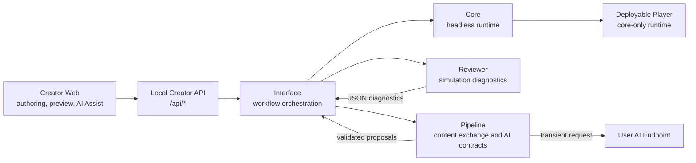
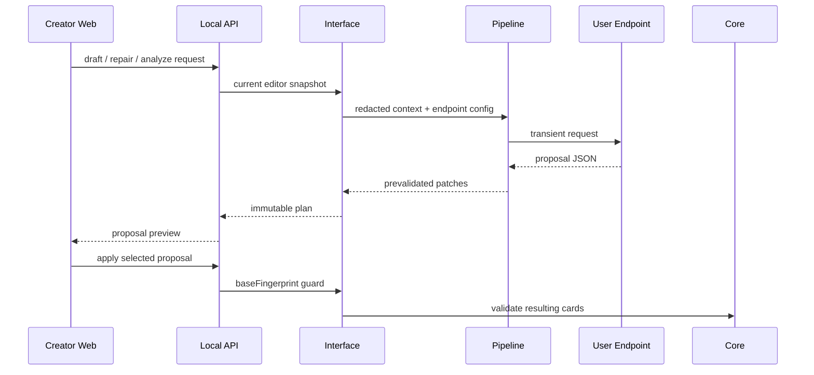

# ReignsAgent

<p align="center">
  
</p>

<p align="center">
  
</p>

ReignsAgent is a modular authoring, validation, and publishing stack for Reigns-like card narratives. It combines a creator workbench, a deterministic headless runtime, simulation-based diagnostics, content import/export tooling, and a deployable player build path.

The project is built for two primary audiences: creators who need a practical workspace for narrative card production, and AI-assisted workflows that need clear contracts for drafting, repairing, validating, and shipping content without crossing runtime boundaries.

## Contents

- [Capabilities](#capabilities)
- [Design Boundaries](#design-boundaries)
- [Quick Start](#quick-start)
- [Creator Workflow](#creator-workflow)
- [Architecture](#architecture)
- [Content Model](#content-model)
- [AI-Assisted Workflows](#ai-assisted-workflows)
- [Build Output](#build-output)
- [Package Examples](#package-examples)
- [Repository Layout](#repository-layout)
- [Verification](#verification)

## Capabilities

| Area | Scope |
| --- | --- |
| Creator workbench | Import, edit, review, preview, configure AI Assist, and prepare builds from a single browser workspace. |
| Core runtime | Deterministic headless play sessions with four default gauges, card scheduling, choices, game-over detection, snapshots, restore, and event logs. |
| Reviewer | Monte Carlo simulation, graph reachability, coverage diagnostics, pacing checks, endings analysis, and balance warnings. |
| Pipeline | JSON/CSV/content-bundle exchange, generation request contracts, endpoint protocol handling, patch prevalidation, and reviewer feedback actions. |
| Deployable player | Standalone player assets built from validated content and core runtime code only. |
| AI Assist | User-supplied endpoint workflow for draft proposals, review repair, story edits, and visual request previews. |

## Design Boundaries

ReignsAgent keeps the player model deliberately small: one active card, two choices, four default gauges, and pure left/right interaction. Narrative progression is expressed through author-owned data such as tags, variables, card requirements, metadata, story groups, arcs, endings, i18n, and presentation configuration.

The product does not ship built-in equipment, pets, inventory, shops, rarity, crafting, classes, skill trees, loot, or resource-management systems. Those concepts can appear as story text or user-defined labels in content, but they are not built-in gameplay loops or product features.

AI Assist is creator-side tooling. Deployable player builds do not include provider SDKs, API keys, network AI calls, generated-edit tooling, or AI-specific gameplay behavior.

## Quick Start

Install dependencies and run the full verification gate:

```sh
npm install
npm run verify
```

Start the local creator stack:

```sh
npm run dev:interface
npm run dev:dashboard
```

Open the local surfaces:

| Surface | URL |
| --- | --- |
| Creator Workbench | `http://127.0.0.1:5173/workbench` |
| Preview Player | `http://127.0.0.1:5173/play` |
| Local API | `http://localhost:4321/api/editor` |

Common project commands:

```sh
npm test
npm run build:dashboard
npm run build:game -- fixtures/content/oss-court.cards.json dist/player
npm run content:validate -- fixtures/content/minimal.cards.json
npm run content:review -- fixtures/content/minimal.cards.json --cycles 100 --maxTurns 20
npm run content:convert -- fixtures/content/minimal.cards.json tmp.cards.csv
npm run content:feedback -- review-report.json
```

## Creator Workflow

The main authoring UI lives in `apps/creator-web`.

| Workspace area | Purpose |
| --- | --- |
| Overview | Project health, card count, validation state, player readiness, review status, and build status. |
| Content | Content-bundle import, card editing, left/right choice tuning, gauge effects, tags, variables, and art bindings. |
| Story | Reachability, left/right transitions, story groups, endings, graph issues, and reviewer heat. |
| Review | Narrative QA for balance, pacing, coverage, unreachable paths, endings, and story group health. |
| AI Assist | User endpoint configuration plus reviewable draft, repair, story, and visual proposals. |
| Preview | Local Reigns-style play sessions using keyboard, pointer drag, touch, or buttons. |
| Build | Deployable `.game.json` and player asset preparation. |
| Settings | Creator skin, endpoint protocol, model id, capability flags, and route compatibility. |

Workbench URLs preserve panel state, for example `/workbench/content`. Skin state is shared through query parameters such as `?skin=github-light`, `?skin=catppuccin-latte`, and `?skin=classic`; preview player pages accept the same `skin` query.

## Architecture



| Layer | Responsibility |
| --- | --- |
| `packages/core` | Headless deterministic runtime. No UI, IO, AI, reviewer, pipeline, or deployment code. |
| `packages/reviewer` | Simulation, graph diagnostics, narrative coverage, endings analysis, and balance reporting. |
| `packages/pipeline` | Content exchange, AI request contracts, endpoint normalization, patch prevalidation, and feedback actions. |
| `packages/interface` | Creator workflow orchestration, local web surfaces, play-session helpers, diagnostics projection, and build assembly. |
| `apps/creator-web` | Vite/React creator workspace. |

## Content Model

Cards and metadata are the product contract.

| Field | Role |
| --- | --- |
| `requirements.tags` | Gate cards on acquired or missing tags. |
| `requirements.variables` | Gate cards on exact variable values. |
| `requirements.factions` | Gate cards on `gauge0`, `gauge1`, `gauge2`, and `gauge3` with `min`, `max`, or `equals`. |
| `choices[].effects.tags` | Set or clear tags after a choice. |
| `choices[].effects.variables` | Change low-level variable state after a choice. |
| `choices[].effects.factions` | Change the default four gauges. |
| `metadata.story.groups` | Describe chapters, themes, arcs, endings, or other authoring groups. |
| `metadata.presentation.gauges` | Rename, describe, or hide the default gauge displays. |
| `metadata.i18n` and card-level `i18n` | Provide localized card text and choice labels. |

Legacy `faith`, `people`, `military`, and `treasury` keys are accepted on import and normalized to neutral `gauge0` through `gauge3` slots.

## AI-Assisted Workflows

ReignsAgent is designed to work with AI systems as controlled collaborators. AI output should be explicit, reviewable, and validated before it becomes authored content.

For content generation or repair:

- Keep playable cards binary: exactly one left choice and one right choice.
- Use tags, variables, requirements, story groups, and endings for progression.
- Use only the default four gauge slots for built-in balance.
- Return proposals or patches that can be reviewed and applied deliberately.

For code changes:

- Keep core runtime changes headless and deterministic.
- Keep endpoint calls and prompt/proposal handling in creator-side workflows.
- Keep deployable player output free of credentials, provider SDKs, network AI calls, and editor-only tooling.
- Run `npm run verify` before considering changes ready.

### Endpoint Proposal Flow



## Build Output

Build a deployable player from a content bundle:

```sh
npm run build:game -- fixtures/content/oss-court.cards.json dist/player
```

The build emits:

| Output | Description |
| --- | --- |
| `*.game.json` | Deployable content bundle. |
| `player.html` | Standalone player page. |
| `player-runtime.js` | Player runtime with stitched core logic. |
| `assets/logo-alpha.png` | Transparent product logo. |
| Local content assets | Assets referenced by the bundle, such as `assets/sample/*.svg`. |

## Package Examples

### Core Runtime

```js
import { createRuntime, restoreState } from "@reigns-agent/core";

const runtime = createRuntime({ cards, rng: () => 0 });
const result = runtime.step("accept");
const snapshot = runtime.snapshot();

const restored = createRuntime({
  cards,
  state: restoreState(snapshot),
  rng: () => 0
});

console.log(result.event, restored.events);
```

### Reviewer

```js
import { runMonteCarloReview, runSimulationCycle } from "@reigns-agent/reviewer";

const cycle = runSimulationCycle({
  cards,
  seed: 7,
  maxTurns: 20,
  includeEvents: true
});

const report = runMonteCarloReview({
  cards,
  cycles: 1000,
  maxTurns: 50,
  sampleLimit: 3,
  thresholds: { dominantGameOverRate: 0.45 }
});

console.log(cycle.terminalReason, report.diagnostics.warnings);
```

### Pipeline

```js
import {
  buildCardGenerationRequest,
  createDiagnosticFeedback,
  parseContentJson,
  stringifyContentJson
} from "@reigns-agent/pipeline";

const bundle = parseContentJson(sourceText);
const request = buildCardGenerationRequest({
  theme: bundle.metadata.title ?? "untitled",
  count: 8,
  diagnostics: reviewerReport
});
const feedback = createDiagnosticFeedback(reviewerReport);

console.log(request.requestId, feedback.actions, stringifyContentJson(bundle));
```

### Interface

```js
import {
  createCardEditor,
  createPlaySession,
  prepareGameBuild,
  runDiagnostics
} from "@reigns-agent/interface";

const editor = createCardEditor({ cards, metadata: { title: "Small Court" } });
const diagnostics = runDiagnostics({ cards: editor.toCards(), cycles: 1000, maxTurns: 50 });
const session = createPlaySession({ cards: editor.toCards(), rng: () => 0 });

session.start();
session.swipe("left");

const build = prepareGameBuild({ editor, buildId: "small-court-preview" });

console.log(diagnostics.healthScore, session.factions, build.player.choiceModel);
```

## Repository Layout

| Path | Purpose |
| --- | --- |
| `apps/creator-web` | Creator dashboard workspace. |
| `packages/core` | Headless game runtime. |
| `packages/reviewer` | Simulation and diagnostic engine. |
| `packages/pipeline` | Content exchange and AI proposal contracts. |
| `packages/interface` | Creator orchestration and player build assembly. |
| `scripts` | Dev server, content CLI, build-game assembler, and verification gates. |
| `fixtures` | Sample and validation content. |
| `test` | Cross-package integration tests. |

## Verification

Before treating a change as ready:

```sh
npm run verify
```

For deployable player changes:

```sh
npm run build:game -- fixtures/content/oss-court.cards.json <temporary-output-dir>
```
