# ReignsAgent

ReignsAgent is a production-oriented, Reigns-like project for generating, testing, editing, previewing, and shipping card-based narrative experiences.

Phase 1 implements `@reigns-agent/core`: a pure runtime with factions, card scheduling, game-over checks, low-level variable/tag hooks, JSON-safe snapshots, restore, deterministic steps, and event logs. Phase 2 adds `@reigns-agent/reviewer`: a headless Monte Carlo diagnostic engine, single-cycle simulator, event samples, coverage metrics, configurable warning thresholds, and card graph analyzer. Phase 3 adds `@reigns-agent/pipeline`: local JSON/CSV/content-bundle exchange, stable connector request contracts, reviewer-feedback action plans, and local content workflow commands. Phase 4 adds `@reigns-agent/interface`: creator orchestration, player-card validation, local dashboard/player preview APIs, diagnostics projection, connector request preview, and deployable player build assembly.

The repository intentionally contains no built-in RPG management systems or provider-specific SDK wiring. Narrative progression is allowed as author-owned data: tags, variables, metadata, chapters, themes, arcs, endings, and configurable gauge presentation can shape the story while the player-facing interaction remains pure left/right card swipes. The interface package coordinates the existing modules without moving game rules, generation logic, or reviewer simulation into the frontend layer.

The current baseline includes card contract validation, player-card validation, fixture verification, package export smoke tests, module boundary checks, Anti-RPG drift checks, deployable player smoke tests, unit tests, and integration tests. `fixtures/content/oss-court.cards.json` is a complete local sample deck with CC BY 3.0 SVG art assets from Game-icons.net, `en`/`zh-Hans` i18n metadata, and policy-gated presentation customization.

## Commands

```sh
npm run verify
npm test
npm run dev:interface
npm run dev:dashboard
npm run build:dashboard
npm run build:game -- fixtures/content/oss-court.cards.json dist/player
npm run content:validate -- fixtures/content/minimal.cards.json
npm run content:review -- fixtures/content/minimal.cards.json --cycles 100 --maxTurns 20
npm run content:convert -- fixtures/content/minimal.cards.json tmp.cards.csv
npm run content:feedback -- review-report.json
```

## Creator dashboard

`npm run dev:dashboard` starts the Vite/React creator workspace (default `http://127.0.0.1:5173`) and proxies API requests to `npm run dev:interface`. Use `5173` as the only creator UI while editing. `npm run dev:interface` starts the local backend API server (default `http://localhost:4321`) and serves only data routes for the creator app; `/workbench`, `/classic`, `/play`, and local asset serving live on the Vite side during development.

- **Ingest** — import a local `.cards.json` / content bundle or paste JSON; the Open Court sample deck loads with one click.
- **Content** — author cards through a structured card desk: card text, left/right labels, author-readable appearance and choice-outcome summaries, default gauge deltas, tag/variable effects, validation messages, and focused repair entry points. Advanced JSON/state editing should remain available without being the default creator path.
- **Story** — inspect and edit the narrative structure as a graph: card reachability, L/R transition edges, semantic tag labels, drag-to-connect wiring, explicit disconnect controls, reviewer heat, issue navigation with repair guidance, and chapter/theme/arc grouping.
- **Review** — run headless narrative QA. Diagnostics include default gauge pressure, graph/coverage warnings, and `metadata.story.groups` coverage for chapters, themes, arcs, and endings instead of treating review as numeric balance only.
- **AI Assist** — configure user-supplied AI endpoints and use context-rich draft actions for card writing, latest-review repair, story editing, visual generation request previews, and visual analysis request previews. Settings follow a NewAPI-style channel setup: provider channel type with official/brand logo, API key with show/hide control, editable model presets/model id, optional `/models` fetch, editable base URL, and capability toggles, with protocol and route compatibility in Advanced. Validate performs a real backend/provider request without mutating the editor. Text endpoint output is validated as explicit patch proposals before applying changes through the normal editor validation and undo/draft flow.
- **Preview** — Reigns-style swipe over the headless core via keyboard (← → / A D), pointer drag, touch, or buttons. The end-of-run summary shows turns survived and the losing faction; "Play again" restarts.
- **Build** — assemble and export a self-contained deployable `.game.json`.

The workbench URL carries panel state (`/workbench/content`) and optional skin state (`?skin=catppuccin-latte`) without forcing a hard reload, so creator sessions can be refreshed or shared directly. In-progress editor work is still saved to `localStorage` and offered for restore on reload (server-validated through `/api/editor/restore`); player previews also accept the same `skin` query so creator and player surfaces stay visually aligned. The default `workbench` skin is displayed as Github Light.

Story progression remains data-driven. Authors should express narrative evolution through card `requirements`, choice `effects.tags`, choice `effects.variables`, and optional metadata labels. Card requirements can combine tag gates, exact variable gates, and default gauge thresholds through `requirements.factions` (`gauge0`, `gauge1`, `gauge2`, `gauge3` only, with `min`/`max`/`equals`). The Story workspace reads lightweight `metadata.story.groups` entries for chapters/themes/arcs/endings as an authoring organization layer only; these groups filter and explain the graph without changing core scheduling. Presentation metadata may use `metadata.presentation.gauges` to rename, describe, or hide the default four gauge displays without adding new player stats. Legacy `faith`/`people`/`military`/`treasury` keys are accepted on import and normalized to neutral gauge slots.

AI Assist is a creator-only workflow. The local creator backend can execute user-configured text endpoints for canonical `openai_chat`, `openai_responses`, and `openai_completions` protocols while keeping legacy `messages`, `responses`, and `completions` as accepted aliases. Generic, unified base URI, and SenseNova presets default to OpenAI-compatible Chat Completions; route mode can auto-detect full protocol URLs or force API-root/full-URL behavior. API keys are passed transiently for the active local request and are not stored or returned in validation results or plans. AI Assist must not put API keys, provider SDKs, AI request code, or generated-edit tooling into the deployable player. Endpoint/model presets are frontend-owned convenience data, not backend provider profiles.

```mermaid
flowchart LR
  creator["Creator Web UI<br/>settings, prompt, proposal preview"]
  localApi["Local Creator API<br/>/api/ai/edit/*"]
  interface["Interface Package<br/>editor snapshot, config redaction, stale apply guard"]
  pipeline["Pipeline Package<br/>AI context, endpoint protocol, JSON parsing, patch prevalidation"]
  provider["User Endpoint<br/>OpenAI-compatible responses/chat/completions"]
  reviewer["Reviewer Package<br/>headless diagnostics JSON"]
  core["Core Package<br/>headless rules and validation"]
  player["Deployable Player<br/>core-only swipe runtime"]

  creator -->|"transient credentials.apiKey only"| localApi
  localApi --> interface
  interface -->|"current content bundle + diagnostics"| pipeline
  reviewer -->|"diagnostic report for repair context"| interface
  pipeline -->|"redacted fetch, no SDK"| provider
  provider -->|"{ proposals: [...] }"| pipeline
  pipeline -->|"validated plan, no mutation"| interface
  interface -->|"explicit selected patches only"| localApi
  localApi --> creator
  interface -->|"apply after baseFingerprint check"| core
  core -->|"validated bundle"| interface
  core --> player

  provider -. no provider calls from protected modules .-> player
```



`npm run build:game -- <bundle.json> <out.dir>` stitches a deployable player (`player.html` + `player-runtime.js`) that imports only the headless core — no pipeline, reviewer, or dashboard code ships to players.

## Core Runtime Example

```js
import { createRuntime, restoreState } from "@reigns-agent/core";

const runtime = createRuntime({ cards, rng: () => 0 });
const result = runtime.step("accept");
const snapshot = runtime.snapshot();

const restored = createRuntime({
  cards,
  state: restoreState(snapshot),
  rng: () => 0
});

console.log(result.event, restored.events);
```

## Reviewer Example

```js
import { runMonteCarloReview, runSimulationCycle } from "@reigns-agent/reviewer";

const cycle = runSimulationCycle({
  cards,
  seed: 7,
  maxTurns: 20,
  includeEvents: true
});

const report = runMonteCarloReview({
  cards,
  cycles: 1000,
  maxTurns: 50,
  sampleLimit: 3,
  thresholds: { dominantGameOverRate: 0.45 }
});

console.log(cycle.terminalReason, report.diagnostics.warnings);
```

## Pipeline Example

```js
import {
  buildCardGenerationRequest,
  createDiagnosticFeedback,
  parseContentJson,
  stringifyContentJson
} from "@reigns-agent/pipeline";

const bundle = parseContentJson(sourceText);
const request = buildCardGenerationRequest({
  theme: bundle.metadata.title ?? "untitled",
  count: 8,
  diagnostics: reviewerReport
});
const feedback = createDiagnosticFeedback(reviewerReport);

console.log(request.requestId, feedback.actions, stringifyContentJson(bundle));
```

## Interface Example

```js
import {
  createCardEditor,
  createPlaySession,
  prepareGameBuild,
  runDiagnostics
} from "@reigns-agent/interface";

const editor = createCardEditor({ cards, metadata: { title: "Small Court" } });
const diagnostics = runDiagnostics({ cards: editor.toCards(), cycles: 1000, maxTurns: 50 });
const session = createPlaySession({ cards: editor.toCards(), rng: () => 0 });

session.start();
session.swipe("left");

const build = prepareGameBuild({ editor, buildId: "small-court-preview" });

console.log(diagnostics.healthScore, session.factions, build.player.choiceModel);
```

## Presentation And i18n

Content may define `metadata.presentation.css.variables` for theme-level CSS custom properties. It may also define `metadata.presentation.gauges` entries for the default `gauge0`, `gauge1`, `gauge2`, and `gauge3` slots with `label`, `description`, and `visible`/`hidden` display settings. Unknown gauge keys are rejected so this remains presentation metadata, not an arbitrary RPG attribute system. Raw CSS, HTML, and JS slots are normalized and exported for trusted hosts, but built-in players only apply raw CSS when `metadata.presentation.policy.allowCssText` is true and never execute HTML/JS by default.

Content may define `metadata.i18n` plus per-card `i18n` entries. `createPlaySession({ locale })` and deployable `createPlayer(build, { locale })` resolve locale fallback and return localized card text and choice labels.
