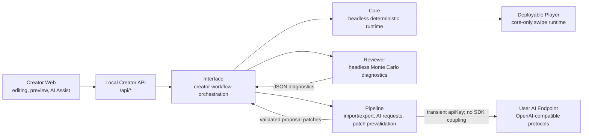
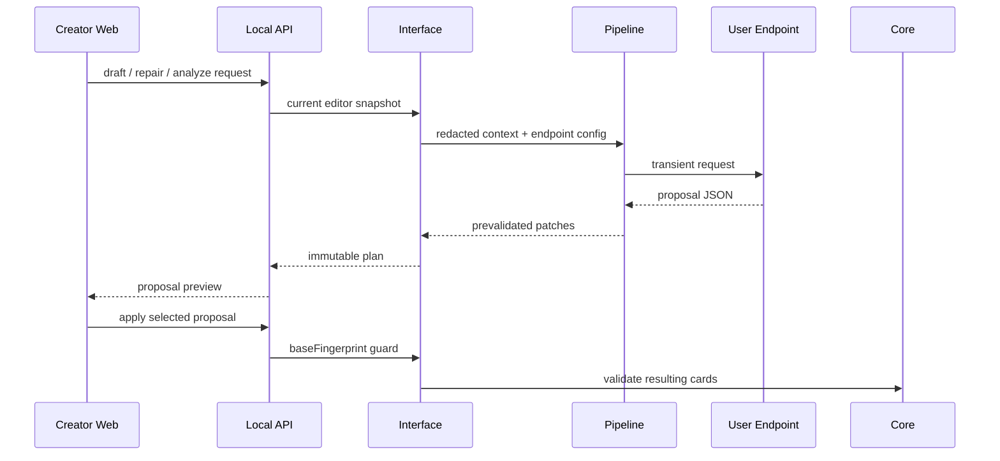

# ReignsAgent

<p align="center">
  
</p>

<p align="center">
  
  
</p>

ReignsAgent is a production-oriented Reigns-like creator system for generating, testing, editing, previewing, and shipping card-based narrative experiences. It is not only developer middleware: the product goal is a usable frontend where content creators can import content, configure AI generation, edit cards, structure narrative progression, preview gameplay, inspect diagnostics, and prepare deployable game builds.

## Who This Is For

- **Content creators** who want a structured workspace for building Reigns-like card narratives.
- **Game developers** who want headless runtime, reviewer, pipeline, and deployable-player packages.
- **AI-assisted users** who want an AI system to understand the project boundaries before proposing content, code, or build changes.

## Product Constraints

The player-facing game stays intentionally pure: card text, binary left/right choices, four default gauge/faction values, low-level variables/tags, endings, loops, and clean swipe interaction.

ReignsAgent does not ship built-in equipment, pets, inventory, shop, rarity, crafting, classes, skill trees, loot, or resource-management gameplay. Narrative progression belongs in author-owned data, not in predefined RPG feature systems.

## Product Direction

ReignsAgent is designed around a self-improving authoring loop:

- **Core** runs deterministic game rules headlessly and stays small, UI-free, IO-free, and AI-free.
- **Reviewer** stress-tests card sets through Monte Carlo simulation and emits objective JSON diagnostics.
- **Pipeline** handles local content exchange, AI request contracts, import/export, and reviewer feedback actions.
- **Interface / Creator Web** provides the creator workflow: editing, AI Assist, preview, diagnostics, and deployment preparation.

Narrative progression is allowed through author-owned data: tags, variables, metadata, chapters, themes, arcs, endings, and configurable gauge presentation. These are organization and authoring concepts, not built-in RPG systems.

## Current Capabilities

- Card contract validation, player-card validation, fixture verification, package export checks, module boundary checks, and Anti-RPG drift checks.
- Headless core runtime with card scheduling, choices, game-over detection, variable/tag hooks, JSON-safe snapshots, restore, deterministic steps, and event logs.
- Reviewer diagnostics with Monte Carlo reports, single-cycle simulation, event samples, graph reachability, coverage, pacing, endings, and balance warnings.
- Pipeline workflows for JSON, CSV, content bundles, stable generation request contracts, endpoint protocol handling, and diagnostic feedback actions.
- Creator Web workspace with ingest, card editing, story graph, review diagnostics, AI Assist, player preview, settings, and build preparation.
- Deployable player output: `player.html`, `player-runtime.js`, `*.game.json`, and static assets, with no creator-only AI tooling.
- Sample content in `fixtures/content/oss-court.cards.json`, including `en` / `zh-Hans` i18n metadata, sample art assets, and policy-gated presentation customization.

## Architecture



Architecture boundaries:

- `packages/core` is the stable headless rules layer. It has no UI, file IO, AI, Pipeline, Reviewer, or deployment responsibilities.
- `packages/reviewer` consumes headless card data and emits diagnostics. It does not own editor or player UI.
- `packages/pipeline` owns import/export and AI request/proposal contracts. It does not run player gameplay.
- `packages/interface` coordinates creator workflows without moving game rules into the frontend.
- Deployable player builds must stay player-only and must not include creator-side AI Assist tooling.

## Quick Start

```sh
npm install
npm run verify
```

Common commands:

```sh
npm test
npm run dev:interface
npm run dev:dashboard
npm run build:dashboard
npm run build:game -- fixtures/content/oss-court.cards.json dist/player
npm run content:validate -- fixtures/content/minimal.cards.json
npm run content:review -- fixtures/content/minimal.cards.json --cycles 100 --maxTurns 20
npm run content:convert -- fixtures/content/minimal.cards.json tmp.cards.csv
npm run content:feedback -- review-report.json
```

Development entry points:

- Creator Workbench: `http://127.0.0.1:5173/workbench`
- Preview Player: `http://127.0.0.1:5173/play`
- Local API: `http://localhost:4321/api/editor`

For local development, start `npm run dev:interface` first, then `npm run dev:dashboard`. Vite owns `/workbench`, `/classic`, `/play`, and local static assets during development. The local API server serves creator data routes.

## Creator Workbench

The Vite/React workbench in `apps/creator-web` is the recommended creator UI. It consumes the local API while keeping visual skins isolated from core product logic.

| Panel | Purpose |
| --- | --- |
| **Overview** | Project health, card count, validation state, player readiness, review state, and build status. |
| **Content** | JSON/content-bundle ingest, structured card editing, left/right labels, gauge deltas, tags, variables, art bindings, validation messages, and repair entry points. |
| **Story** | Narrative graph inspection and editing: L/R transitions, reachability, tag labels, issue navigation, reviewer heat, and chapters/themes/arcs/endings groups. |
| **Review** | Headless QA for gauge pressure, graph coverage, unreachable paths, endings, pacing, and story group coverage. |
| **AI Assist** | User-supplied endpoint configuration, draft generation, latest-review repair, story editing, visual request previews, and visual analysis request previews. |
| **Preview** | Reigns-style swipe preview over the headless core via keyboard, pointer drag, touch, or buttons. |
| **Build** | Prepare deployable `.game.json` and player assets. |
| **Settings** | Configure creator skin, endpoint protocol, model id, capability flags, and advanced route compatibility. |

Workbench routes preserve panel state, such as `/workbench/content`. Skin state is shared through URL parameters like `?skin=github-light`, `?skin=catppuccin-latte`, or `?skin=classic`, and preview player pages accept the same `skin` query so creator and player surfaces remain aligned. In-progress editor work is stored in `localStorage` and restored through server validation at `/api/editor/restore`.

## Content Model

Authors express narrative state and progression through data:

- `requirements.tags` gates cards on acquired or missing tags.
- `requirements.variables` gates cards on exact variable values.
- `requirements.factions` gates cards on `gauge0`, `gauge1`, `gauge2`, and `gauge3` with `min`, `max`, or `equals`.
- `choices[].effects.tags` sets or clears tags after a choice.
- `choices[].effects.variables` changes low-level variable state after a choice.
- `choices[].effects.factions` changes the default four gauges.
- `metadata.story.groups` defines chapters, themes, arcs, endings, or other authoring groups.
- `metadata.presentation.gauges` renames, describes, or hides default gauge displays.
- `metadata.i18n` and card-level `i18n` provide localized card text and choice labels.

`metadata.presentation.gauges` can only describe the default four gauges. Unknown gauge keys are rejected so presentation metadata does not become an arbitrary RPG attribute system.

Legacy `faith`, `people`, `military`, and `treasury` keys are accepted on import and normalized to neutral `gauge0` through `gauge3` slots.

## AI Assist Boundary

AI Assist is a creator workflow, not player gameplay.

- Users supply endpoint settings: base URL, API key, protocol, model id, and capability flags.
- Supported canonical protocols include `openai_chat`, `openai_responses`, and `openai_completions`; `messages`, `responses`, and `completions` remain accepted aliases.
- API keys are passed transiently for the current local request and are not stored, echoed in validation results, or written into builds.
- Endpoint output must become explicit proposals and validated patches before it can become authored content.
- Deployable player builds must not contain provider SDKs, API keys, network AI calls, generated-edit tooling, or AI-specific gameplay behavior.

## Using ReignsAgent With AI

When using an AI system to help create content or modify the project, give it this README plus the relevant files for the task. The most useful AI behavior is proposal-oriented: draft content, explain tradeoffs, validate card contracts, repair reviewer warnings, or suggest code changes that respect package boundaries.

For content work, AI output should preserve these rules:

- Keep each playable card binary: one left choice and one right choice.
- Use tags, variables, story groups, endings, and metadata for narrative progression.
- Use only the default four gauge slots for built-in player balance.
- Return explicit, reviewable changes rather than silently mutating content.

For code work, AI output should preserve these boundaries:

- Keep Core headless and deterministic.
- Keep AI endpoint calls in creator-side workflows.
- Keep deployable player output free of provider credentials, SDKs, network AI calls, and editor-only tooling.
- Run `npm run verify` before treating a change as ready.



## Build And Ship

```sh
npm run build:game -- fixtures/content/oss-court.cards.json dist/player
```

The build emits:

- `*.game.json` - deployable content bundle.
- `player.html` - standalone player page.
- `player-runtime.js` - player runtime with stitched core logic.
- `assets/logo-alpha.png` - transparent product logo.
- Local content assets referenced by the bundle, such as `assets/sample/*.svg`.

`player-runtime.js` should remain self-contained and core-only. Pipeline, Reviewer, Creator UI, and AI Assist code should not ship to players.

## Repository Map

| Path | Responsibility |
| --- | --- |
| `apps/creator-web` | Vite/React creator dashboard workspace. |
| `packages/core` | Pure headless runtime with no UI, IO, AI, or deployment logic. |
| `packages/reviewer` | Monte Carlo simulation, graph diagnostics, and balance reports. |
| `packages/pipeline` | Local import/export, content bundles, AI request contracts, and reviewer feedback actions. |
| `packages/interface` | Creator workflow orchestration, local web surfaces, and deployable player templates. |
| `scripts` | Dev server, content CLI, build-game assembler, and verification gates. |
| `fixtures` | Sample and validation content used by tests and local demos. |
| `test` | Cross-package integration tests. |

## Core Runtime Example

```js
import { createRuntime, restoreState } from "@reigns-agent/core";

const runtime = createRuntime({ cards, rng: () => 0 });
const result = runtime.step("accept");
const snapshot = runtime.snapshot();

const restored = createRuntime({
  cards,
  state: restoreState(snapshot),
  rng: () => 0
});

console.log(result.event, restored.events);
```

## Reviewer Example

```js
import { runMonteCarloReview, runSimulationCycle } from "@reigns-agent/reviewer";

const cycle = runSimulationCycle({
  cards,
  seed: 7,
  maxTurns: 20,
  includeEvents: true
});

const report = runMonteCarloReview({
  cards,
  cycles: 1000,
  maxTurns: 50,
  sampleLimit: 3,
  thresholds: { dominantGameOverRate: 0.45 }
});

console.log(cycle.terminalReason, report.diagnostics.warnings);
```

## Pipeline Example

```js
import {
  buildCardGenerationRequest,
  createDiagnosticFeedback,
  parseContentJson,
  stringifyContentJson
} from "@reigns-agent/pipeline";

const bundle = parseContentJson(sourceText);
const request = buildCardGenerationRequest({
  theme: bundle.metadata.title ?? "untitled",
  count: 8,
  diagnostics: reviewerReport
});
const feedback = createDiagnosticFeedback(reviewerReport);

console.log(request.requestId, feedback.actions, stringifyContentJson(bundle));
```

## Interface Example

```js
import {
  createCardEditor,
  createPlaySession,
  prepareGameBuild,
  runDiagnostics
} from "@reigns-agent/interface";

const editor = createCardEditor({ cards, metadata: { title: "Small Court" } });
const diagnostics = runDiagnostics({ cards: editor.toCards(), cycles: 1000, maxTurns: 50 });
const session = createPlaySession({ cards: editor.toCards(), rng: () => 0 });

session.start();
session.swipe("left");

const build = prepareGameBuild({ editor, buildId: "small-court-preview" });

console.log(diagnostics.healthScore, session.factions, build.player.choiceModel);
```

## Development Checks

Before treating a change as ready, run:

```sh
npm run verify
```

For deployable player changes, also run:

```sh
npm run build:game -- fixtures/content/oss-court.cards.json <temporary-output-dir>
```

For visible frontend changes, smoke test `/workbench` and `/play?skin=<skin>` locally, then confirm selector state, `document.documentElement.dataset.skin`, and key CSS variables match the expected skin.
