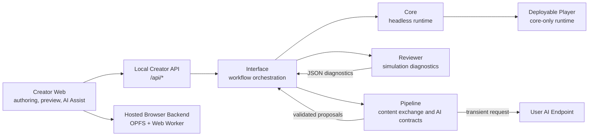
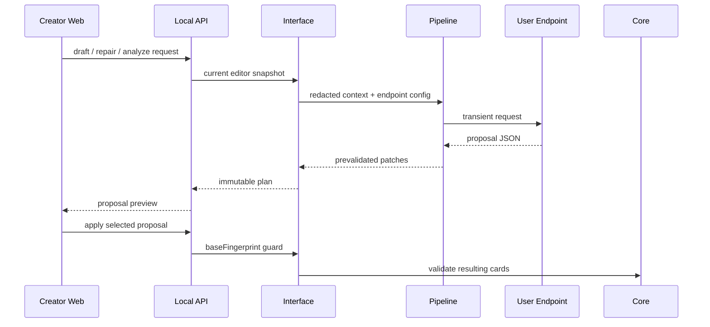

# ReignsAgent

<p align="center">
  
</p>

<p align="center">
  
  
</p>

<p align="center">
  <a href="README.md">English</a> | 简体中文
</p>

ReignsAgent 是一个面向 [Reigns](https://www.devolverdigital.com/games/reigns)-like 卡牌叙事的模块化创作、验证与发布栈。它包含创作者工作台、确定性的无头运行时、基于模拟的诊断系统、内容导入导出工具，以及可部署玩家构建流程。

本项目面向两类核心使用者：需要生产级叙事卡牌工作区的内容创作者，以及需要明确边界来起草、修复、验证和发布内容的 AI 辅助工作流。

## 目录

- [能力概览](#能力概览)
- [设计边界](#设计边界)
- [快速开始](#快速开始)
- [创作者工作流](#创作者工作流)
- [架构](#架构)
- [内容模型](#内容模型)
- [AI 辅助工作流](#ai-辅助工作流)
- [构建输出](#构建输出)
- [Creator 发行模式](#creator-发行模式)
- [Package 示例](#package-示例)
- [仓库结构](#仓库结构)
- [CI 与验证](#ci-与验证)
- [致谢](#致谢)
- [许可证](#许可证)

## 能力概览

| 模块 | 范围 |
| --- | --- |
| 创作者工作台 | 在浏览器工作区中导入、编辑、评审、预览、配置 AI Assist，并准备构建。 |
| Core runtime | 确定性的无头游玩会话，支持四个默认 gauge、卡牌调度、选择、game-over、快照、恢复和事件日志。 |
| Reviewer | 蒙特卡洛模拟、图 reachability、覆盖率诊断、节奏检查、结局分析和平衡警告。 |
| Pipeline | JSON/CSV/content-bundle 交换、生成请求契约、endpoint 协议处理、补丁预校验和 reviewer 反馈动作。 |
| Deployable player | 从已验证内容和 core runtime 构建独立玩家资源。 |
| AI Assist | 用户自带 endpoint 的草稿提案、评审修复、故事编辑和视觉请求预览工作流。 |

## 设计边界

ReignsAgent 将玩家模型保持在很小的范围内：一张当前卡牌、两个选择、四个默认 gauge，以及纯左/右交互。叙事进度通过作者拥有的数据表达，例如 tags、variables、card requirements、metadata、story groups、arcs、endings、i18n 和 presentation 配置。

产品不内置装备、宠物、背包、商店、稀有度、制作、职业、技能树、战利品或资源管理系统。这些概念可以作为故事文本或用户自定义标签出现在内容里，但不是内置玩法循环或产品功能。

AI Assist 是创作者侧工具。可部署玩家构建不包含 provider SDK、API keys、网络 AI 调用、生成式编辑工具或 AI 特定玩法行为。

## 快速开始

安装依赖并运行完整验证门禁：

```sh
npm install
npm run verify
```

启动本地创作者栈：

```sh
npm run dev:interface
npm run dev:dashboard
```

打开本地页面：

| 页面 | URL |
| --- | --- |
| Creator Workbench | `http://127.0.0.1:5173/workbench` |
| Preview Player | `http://127.0.0.1:5173/play` |
| Local API | `http://localhost:4321/api/editor` |

常用命令：

```sh
npm test
npm run build:dashboard
npm run dev:hosted
npm run build:hosted
npm run build:game -- fixtures/content/oss-court.cards.json dist/player
npm run build:release
npm run test:desktop
npm run build:desktop
npm run content:validate -- fixtures/content/minimal.cards.json
npm run content:review -- fixtures/content/minimal.cards.json --cycles 100 --maxTurns 20
npm run content:convert -- fixtures/content/minimal.cards.json tmp.cards.csv
npm run content:feedback -- review-report.json
```

## 创作者工作流

主创作界面位于 `apps/creator-web`。

| 工作区 | 用途 |
| --- | --- |
| Overview | 项目健康度、卡牌数、验证状态、玩家就绪状态、评审状态和构建状态。 |
| Content | content bundle 导入、卡牌编辑、左右选择调校、gauge effects、tags、variables 和素材绑定。 |
| Story | reachability、左右转移、story groups、endings、图问题和 reviewer heat。 |
| Review | 针对平衡、节奏、覆盖率、不可达路径、结局和 story group 健康度的叙事 QA。 |
| AI Assist | 用户 endpoint 配置，以及可审阅的草稿、修复、故事和视觉提案。 |
| Preview | 使用键盘、鼠标拖拽、触摸或按钮进行本地 Reigns-style 游玩会话。 |
| Build | 准备可部署 `.game.json` 和玩家资源。 |
| Settings | creator skin、endpoint protocol、model id、capability flags 和 route compatibility。 |

Workbench URL 会保留面板状态，例如 `/workbench/content`。Skin 状态通过 `?skin=github-light`、`?skin=catppuccin-latte`、`?skin=classic` 等查询参数共享；预览玩家页面也接受同样的 `skin` 参数。

## 架构



Creator UI 有两种宿主适配器。本地 Web、Node ZIP 和 Electron 通过 `HttpCreatorBackend` 使用共享 Creator Server；Hosted PWA 使用 `BrowserCreatorBackend`，将等价的 TOML/content 文档保存在 OPFS 中，通过 Web Worker 执行诊断，并从浏览器直接调用用户的 AI endpoint。两种适配器不会改变 Core、内容、提案或玩家构建契约。

| 层 | 职责 |
| --- | --- |
| `packages/core` | 确定性的无头运行时。不包含 UI、IO、AI、reviewer、pipeline 或部署逻辑。 |
| `packages/reviewer` | 模拟、图诊断、叙事覆盖率、结局分析和平衡报告。 |
| `packages/pipeline` | 内容交换、AI 请求契约、endpoint normalization、补丁预校验和反馈动作。 |
| `packages/interface` | 创作者工作流编排、本地 web surfaces、play-session helpers、诊断投影和构建组装。 |
| `apps/creator-web` | 使用 HTTP 或 Hosted OPFS backend adapter 的 Vite/React 创作者工作区。 |

## Creator 发行模式

### Hosted PWA

无需本地 API 即可启动或构建 Hosted Creator：

```sh
npm run dev:hosted
npm run build:hosted
```

生产产物位于 `apps/creator-web/dist-hosted/`。反向代理或静态站点部署在子路径时，构建前设置 `REIGNS_AGENT_BASE_PATH=/reignsagent/`；应用 URL、Manifest scope、Service Worker 和离线导航都会使用该前缀。

Hosted 项目和 `config.toml` 保存在当前 Origin 的 OPFS 中。v1 正式支持桌面 Chrome/Edge；首次成功加载后可以断网重新打开。清除站点数据会删除 Workspace，更换协议、域名或端口也会进入另一个 Workspace，因此 Settings 提供持久存储状态、Workspace ZIP 和活动项目 ZIP 的导入/导出。备份默认排除明文 API Key，只有用户显式勾选并确认后才包含。

AI 请求从浏览器直接发送到用户配置的 endpoint。HTTPS Creator 只能连接 HTTPS endpoint，localhost 除外；endpoint 必须通过 CORS 允许 Creator Origin、`Authorization` 和 `Content-Type`。项目数据不会经过维护者服务器，也不提供公共 Relay。浏览器玩家导出会在本地组装 ZIP，并排除 AI 设置和凭据。

服务端 `.env` 或进程环境变量读取只属于本地 Creator Server 和自托管服务端。纯静态 Hosted 构建无法读取私有的服务器 `.env`，也绝不能用 `VITE_*` 注入密钥——这些值会编译进所有访客都能下载的前端资源。Hosted 模式由每位用户在自己的浏览器 Workspace 中配置 endpoint 和 Key。

### 本地 Node ZIP

构建完整的本地 Creator 发行包：

```sh
npm run build:release
```

该命令生成 `dist/reigns-agent-<version>/` 和跨平台 ZIP。目标机器需要 Node.js 22 或更高版本；解压后运行 `node start.mjs`，也可使用 Windows 的 `start.cmd` 或 macOS/Linux 的 `sh start.sh`。Creator、API 和玩家预览由同一个 loopback 服务提供，数据默认保存在解压目录旁的 `ReignsAgentData`。

### Electron 便携版

Electron 只是共享 Creator Server 与 WebUI 的可选桌面宿主，不包含独立业务逻辑：

```sh
npm run dev:desktop
npm run test:desktop
npm run build:desktop
```

Windows x64、macOS x64/arm64 和 Linux x64 均只生成便携 ZIP。程序名统一为 ReignsAgent；Electron profile、项目、配置和游戏构建都位于应用旁的 `ReignsAgentData/`。当前产物未签名，可能触发 SmartScreen 或 Gatekeeper 警告。

## 内容模型

卡牌和 metadata 是产品契约。

| 字段 | 作用 |
| --- | --- |
| `requirements.tags` | 根据已获得或缺失的 tags 控制卡牌出现。 |
| `requirements.variables` | 根据变量精确值控制卡牌出现。 |
| `requirements.factions` | 使用 `min`、`max` 或 `equals` 控制 `gauge0`、`gauge1`、`gauge2`、`gauge3`。 |
| `choices[].effects.tags` | 在选择后设置或清除 tags。 |
| `choices[].effects.variables` | 在选择后改变低层变量状态。 |
| `choices[].effects.factions` | 改变默认四个 gauges。 |
| `metadata.story.groups` | 描述 chapters、themes、arcs、endings 或其他创作分组。 |
| `metadata.presentation.gauges` | 重命名、描述或隐藏默认 gauge 展示。 |
| `metadata.i18n` 和 card-level `i18n` | 提供本地化卡牌文本和选择标签。 |

旧版 `faith`、`people`、`military`、`treasury` keys 会在导入时被接受，并标准化到中性的 `gauge0` 到 `gauge3` slots。

## AI 辅助工作流

ReignsAgent 适合与 AI 系统一起作为受控协作者使用。AI 输出应当显式、可审阅，并在成为作者内容之前经过验证。

内容生成或修复应遵守：

- 可游玩的卡牌保持 binary：恰好一个 left choice 和一个 right choice。
- 使用 tags、variables、requirements、story groups 和 endings 表达进度。
- 内置平衡只使用默认四个 gauge slots。
- 返回可审阅、可主动应用的 proposals 或 patches。

代码改动应遵守：

- Core runtime 保持无头且确定性。
- Endpoint 调用和 prompt/proposal 处理留在创作者侧工作流。
- Deployable player 输出不包含 credentials、provider SDK、网络 AI 调用或 editor-only tooling。
- 变更准备就绪前运行 `npm run verify`。

### Endpoint 提案流程



## 构建输出

从 content bundle 构建可部署玩家：

```sh
npm run build:game -- fixtures/content/oss-court.cards.json dist/player
```

构建会输出：

| 输出 | 描述 |
| --- | --- |
| `*.game.json` | 可部署内容 bundle。 |
| `player.html` | 独立玩家页面。 |
| `player-runtime.js` | 已 stitch core logic 的玩家 runtime。 |
| `assets/logo-alpha.png` | 透明产品 logo。 |
| 本地内容素材 | bundle 引用的素材，例如 `assets/sample/*.svg`。 |

## Package 示例

### Core Runtime

```js
import { createRuntime, restoreState } from "@reigns-agent/core";

const runtime = createRuntime({ cards, rng: () => 0 });
const result = runtime.step("accept");
const snapshot = runtime.snapshot();

const restored = createRuntime({
  cards,
  state: restoreState(snapshot),
  rng: () => 0
});

console.log(result.event, restored.events);
```

### Reviewer

```js
import { runMonteCarloReview, runSimulationCycle } from "@reigns-agent/reviewer";

const cycle = runSimulationCycle({
  cards,
  seed: 7,
  maxTurns: 20,
  includeEvents: true
});

const report = runMonteCarloReview({
  cards,
  cycles: 1000,
  maxTurns: 50,
  sampleLimit: 3,
  thresholds: { dominantGameOverRate: 0.45 }
});

console.log(cycle.terminalReason, report.diagnostics.warnings);
```

### Pipeline

```js
import {
  buildCardGenerationRequest,
  createDiagnosticFeedback,
  parseContentJson,
  stringifyContentJson
} from "@reigns-agent/pipeline";

const bundle = parseContentJson(sourceText);
const request = buildCardGenerationRequest({
  theme: bundle.metadata.title ?? "untitled",
  count: 8,
  diagnostics: reviewerReport
});
const feedback = createDiagnosticFeedback(reviewerReport);

console.log(request.requestId, feedback.actions, stringifyContentJson(bundle));
```

### Interface

```js
import {
  createCardEditor,
  createPlaySession,
  prepareGameBuild,
  runDiagnostics
} from "@reigns-agent/interface";

const editor = createCardEditor({ cards, metadata: { title: "Small Court" } });
const diagnostics = runDiagnostics({ cards: editor.toCards(), cycles: 1000, maxTurns: 50 });
const session = createPlaySession({ cards: editor.toCards(), rng: () => 0 });

session.start();
session.swipe("left");

const build = prepareGameBuild({ editor, buildId: "small-court-preview" });

console.log(diagnostics.healthScore, session.factions, build.player.choiceModel);
```

## 仓库结构

| 路径 | 用途 |
| --- | --- |
| `apps/creator-web` | 使用 HTTP 或 Hosted OPFS backend adapter 的 Creator dashboard。 |
| `apps/creator-server` | 本地 Web、Node ZIP 与 Electron 共享的 HTTP API 和静态宿主。 |
| `apps/desktop-electron` | 可选 Electron 生命周期、安全策略和便携 ZIP 外壳。 |
| `packages/core` | 无头游戏运行时。 |
| `packages/reviewer` | 模拟和诊断引擎。 |
| `packages/pipeline` | 内容交换和 AI proposal contracts。 |
| `packages/interface` | 创作者编排和玩家构建组装。 |
| `packages/workspace` | Host-neutral TOML/project 契约，以及 Node filesystem 与浏览器 OPFS adapter。 |
| `scripts` | Dev server、content CLI、build-game assembler 和 verification gates。 |
| `fixtures` | 示例和验证内容。 |
| `test` | 跨 package integration tests。 |

## CI 与验证

仓库在 pull request 和 `master` push 时运行 GitHub Actions，并通过 concurrency 取消同一 ref 的重复任务。CI 在 Node.js 22、24 上执行 `npm ci` 和 `npm run verify`，随后在 Node.js 22 上运行 Hosted PWA/subpath、deployable player 和 Electron smoke。

`hosted-creator-smoke` 声明了 `needs: verify`：每次 Hosted Chromium 测试都必须先通过共享 Pipeline、Interface、Creator Server、AI endpoint 协议和集成测试，而不是在 Hosted job 内重复执行同一套 Node 测试。之后它再验证 `/reignsagent/` scope、PWA 文件、Chromium OPFS 持久化和断网重启。

### 本地验证

在认为变更准备就绪前，运行和 CI 相同的主要门禁：

```sh
npm run verify
```

`npm run verify` 包含：

| 阶段 | 命令 | 目的 |
| --- | --- | --- |
| Syntax check | `node scripts/check-syntax.mjs` | 在更深检查前解析实现 JavaScript 文件。 |
| Export check | `node scripts/verify-exports.mjs` | 确认 workspace package export surfaces 有效。 |
| Boundary check | `node scripts/verify-boundaries.mjs` | 保持 package 职责分离。 |
| Anti-RPG drift check | `node scripts/verify-anti-rpg.mjs` | 保护纯卡牌滑动玩法边界。 |
| Fixture verification | `node scripts/verify-fixtures.mjs` | 验证示例内容和 deployable-player fixture 假设。 |
| Dashboard build | `npm run build:dashboard` | 编译 Vite/React 创作者工作区。 |
| Hosted build | `npm run build:hosted` | 编译 OPFS/CORS-only PWA 与离线资源。 |
| Unit tests | `npm run test:unit` | 运行 package-level Node test suites。 |
| Integration tests | `npm run test:integration` | 运行跨 package integration flows。 |

### 聚焦命令

迭代中可使用聚焦命令，提交前再运行完整门禁：

```sh
npm run build
npm run test:unit
npm run test:integration
npm run test:hosted
npm run content:validate -- fixtures/content/minimal.cards.json
npm run content:review -- fixtures/content/minimal.cards.json --cycles 100 --maxTurns 20
```

### Deployable Player Smoke Build

涉及 deployable player、模板、content bundle 或静态玩家素材时，额外运行：

```sh
npm run build:game -- fixtures/content/oss-court.cards.json <temporary-output-dir>
```

确认输出包含 `player.html`、`player-runtime.js`、`*.game.json` 内容 bundle、`assets/logo-alpha.png`，以及 bundle 引用的本地示例素材。

### 前端 Smoke Test

涉及可见 creator 或 player 改动时：

1. 启动 `npm run dev:interface`。
2. 启动 `npm run dev:dashboard`。
3. 打开 `/workbench` 和 `/play?skin=<skin>`。
4. 在桌面和移动宽度下确认面板状态、skin query 行为、`document.documentElement.dataset.skin` 和可见布局。

## 致谢

ReignsAgent 部分受到 [Reigns](https://www.devolverdigital.com/games/reigns) 将数值平衡作为玩法的启发。

ReignsAgent 是独立项目，与 Reigns、Nerial 或 Devolver Digital 无关。

## 许可证

ReignsAgent 使用 [MIT License](LICENSE) 发布。
