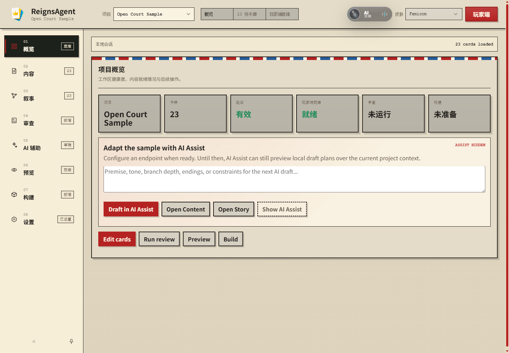
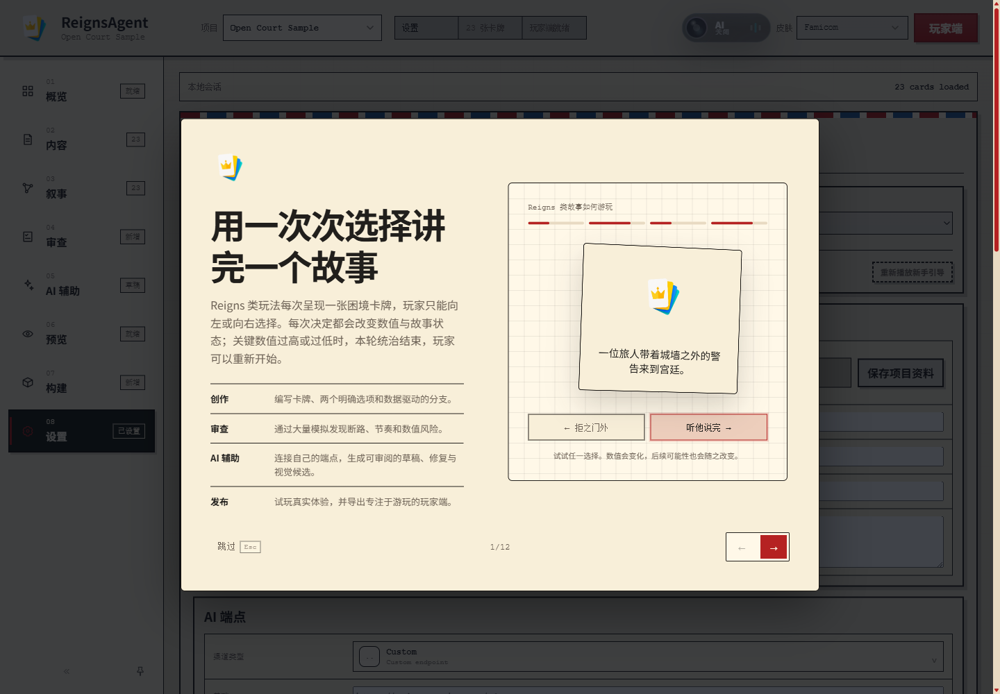
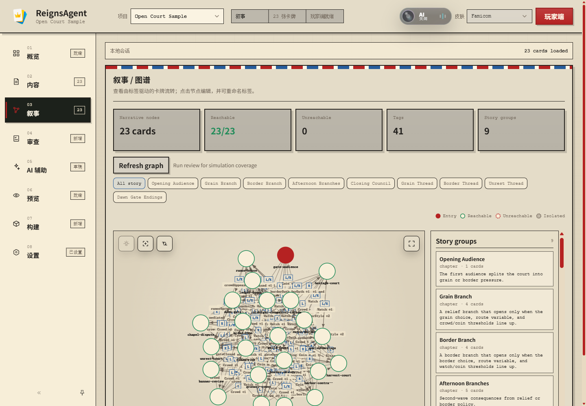
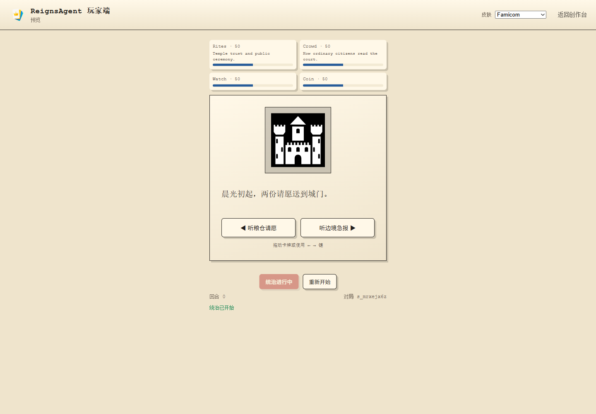
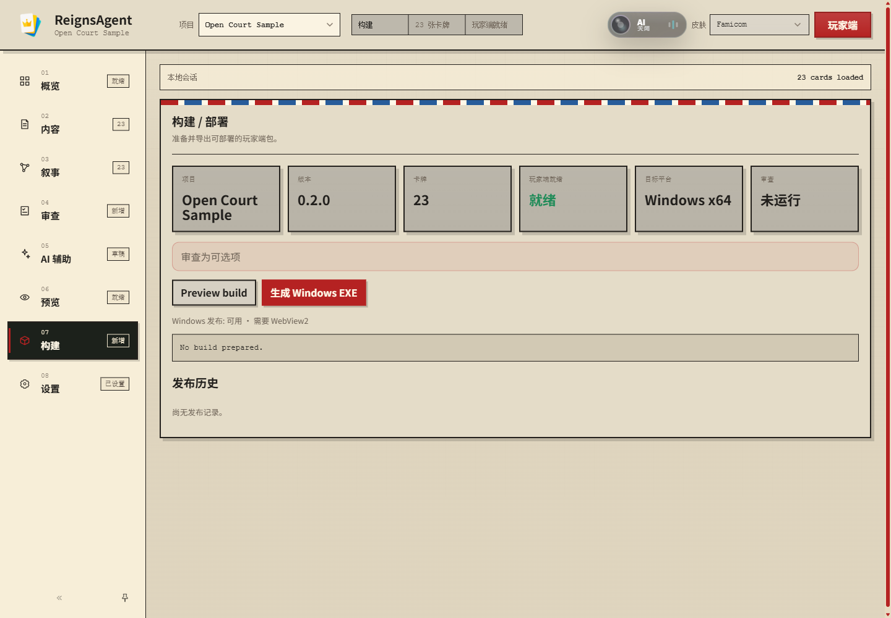
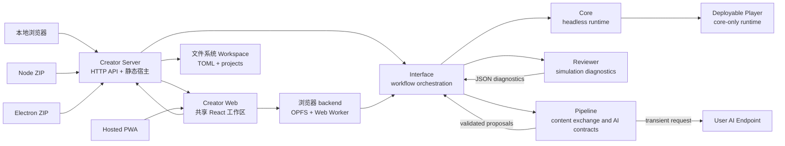
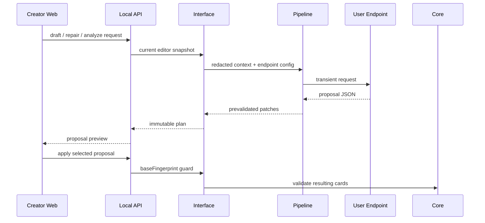

# ReignsAgent

<p align="center">
  
</p>

<p align="center">
  
  
</p>

<p align="center">
  <a href="README.md">English</a> | 简体中文
</p>

ReignsAgent 是一个面向 [Reigns](https://www.devolverdigital.com/games/reigns)-like 卡牌叙事的模块化创作、验证与发布栈。它包含创作者工作台、确定性的无头运行时、基于模拟的诊断系统、内容导入导出工具，以及可部署玩家构建流程。

本项目面向两类核心使用者：需要生产级叙事卡牌工作区的内容创作者，以及需要明确边界来起草、修复、验证和发布内容的 AI 辅助工作流。

## 目录

- [从这里开始：选择并使用客户端](#从这里开始选择并使用客户端)
- [通过新手引导了解产品](#通过新手引导了解产品)
- [能力概览](#能力概览)
- [设计边界](#设计边界)
- [开发者快速开始](#开发者快速开始)
- [创作者工作流](#创作者工作流)
- [架构](#架构)
- [内容模型](#内容模型)
- [AI 辅助工作流](#ai-辅助工作流)
- [构建输出](#构建输出)
- [Creator 发行模式](#creator-发行模式)
- [Package 示例](#package-示例)
- [仓库结构](#仓库结构)
- [CI 与验证](#ci-与验证)
- [致谢](#致谢)
- [许可证](#许可证)

## 从这里开始：选择并使用客户端

ReignsAgent 包含两类应用。**Creator** 是用于制作、检查、测试和发布项目的创作工作区；**Player** 是刻意保持精简的玩家端，只运行一个已发布项目并提供纯左/右选择体验。Player 构建不能编辑自身内容、运行 Review，也不能连接 AI endpoint。

大多数发行版使用者应下载便携桌面 Creator ZIP。其余客户端分别面向免安装浏览器使用、系统 Node.js 工作流、开发和特定部署场景。

| 客户端 | 适合场景 | 安装与存储 | 重要取舍 |
| --- | --- | --- | --- |
| **便携桌面 Creator** | 大多数创作者；离线本地工作 | 解压对应平台 ZIP 后运行 `ReignsAgent`。无需安装系统 Node.js，也没有安装程序。`ReignsAgentData` 位于解压后的应用旁。 | v0.1.0 未签名，操作系统可能显示警告。移动或备份时应让应用与 `ReignsAgentData` 保持在一起。 |
| **本地 Node Creator** | 服务器式本地使用，以及已经安装 Node.js 的用户 | 解压 `reigns-agent-<version>.zip`，安装 Node.js 22+，再运行 `node start.mjs`。Creator 会在默认浏览器打开，数据保存在发行包旁。 | Creator 运行期间需要保持终端进程开启。 |
| **Hosted PWA** | 体验、Chromebook 类场景或静态部署 | 使用当前版本 Chrome 或 Edge 打开 Hosted URL。项目保存在当前 Origin 的浏览器存储中，首次成功加载后可离线重新打开。 | 清除站点数据或更换 Origin 会进入另一个 Workspace。应定期导出备份；AI endpoint 必须支持浏览器 CORS 和 HTTPS。 |
| **源码工作区** | 贡献者和集成开发者 | 从本仓库启动 Creator Server 与 Vite 客户端。默认开发 Workspace 为 `.reigns-agent-data/`。 | 需要 Node.js 22+、npm 依赖和两个开发进程。 |
| **已发布 Player** | 游玩完成后的项目 | 打开作者提供的 Web Player 或项目专属 Windows EXE。 | 它不是 Creator 客户端，永远不包含 Creator、Reviewer、Pipeline、endpoint 设置或凭据。 |



_Creator Overview 是项目设置、卡牌编辑、Review、Preview 与 Release 之间的交接入口。本指南截图使用内置 Open Court 示例和 Famicom skin；实际内容与外观由项目和客户端决定。_

### 启动发行版

[Releases](https://github.com/Sisyphe42/ReignsAgent/releases) 页面提供五个 Creator 归档以及 `SHA256SUMS.txt`：

| 下载文件 | 目标平台 | 解压后的启动方式 |
| --- | --- | --- |
| `ReignsAgent-win32-x64-<version>.zip` | Windows 10/11 x64 | 运行 `ReignsAgent.exe`。 |
| `ReignsAgent-darwin-arm64-<version>.zip` | Apple Silicon macOS | 打开 `ReignsAgent.app`。 |
| `ReignsAgent-darwin-x64-<version>.zip` | Intel macOS | 打开 `ReignsAgent.app`。 |
| `ReignsAgent-linux-x64-<version>.zip` | Linux x64 | 运行 `ReignsAgent` 可执行文件。 |
| `reigns-agent-<version>.zip` | 任何已安装 Node.js 22+ 的平台 | 运行 `node start.mjs`；Windows 还包含 `start.cmd`，macOS/Linux 还包含 `start.sh`。 |

不要直接在 ZIP 内运行应用。应先解压到可写目录，让便携 Workspace `ReignsAgentData` 能在应用旁创建。桌面归档当前未签名，Windows SmartScreen、macOS Gatekeeper 或 Linux 桌面策略可能要求确认首次启动。当前发行版没有安装程序、自动更新、代码签名或公证。

解压前验证下载文件：

```sh
# macOS/Linux；在 ZIP 与 SHA256SUMS.txt 所在目录执行
sha256sum -c SHA256SUMS.txt --ignore-missing
```

```powershell
# Windows PowerShell；将结果与 SHA256SUMS.txt 对应行比较
Get-FileHash .\ReignsAgent-win32-x64-0.1.0.zip -Algorithm SHA256
```

桌面 Creator 会自动启动共享本地服务，并在应用窗口内打开 `/workbench`。Node Creator 会输出 loopback 地址，默认通常为 `http://127.0.0.1:4321/workbench`，然后在默认浏览器打开。关闭桌面窗口会停止其服务；Node Creator 使用 `Ctrl+C` 停止。

### 通过新手引导了解产品

新手引导是一套直接运行在真实 Creator 中的 12 步本地化流程，而不是另建一个教程项目。首屏用可交互的左右选择介绍 Reigns-style 核心循环，后续 spotlight 步骤依次穿过真实工作区：

| 步骤 | 引导内容 |
| --- | --- |
| 介绍 | 一张卡牌、两个选择、四个 gauge、故事状态变化，以及本轮统治如何结束。 |
| Project → Content → Story | 从空白项目或示例副本开始，创作二元选择，并理解标签驱动的叙事结构。 |
| Review → AI Assist | 可复现的模拟诊断，以及受控、可审阅的 AI 提案。 |
| Preview → Build → Player | 使用发布规则试玩、检查发布就绪度，并理解纯玩家端与 Creator 的边界。 |
| Settings → GitHub → Replay | Workspace 偏好和持久化、项目文档、Release、问题追踪以及重播入口。 |



引导只会在当前客户端首次普通访问 `/workbench` 时自动启动。显式深层链接（例如 `/workbench/content`）优先于 onboarding，保证分享链接的确定性。完成状态写入带异常保护的客户端本地存储：**完成**、**跳过**或 `Esc` 都会抑制下次自动启动；如果 `localStorage` 不可用或抛出异常，Creator 会安全回退，不会因此无法启动。

可以使用屏幕箭头、键盘 `Left`/`Right` 或 `Space` 前后移动，按 `Esc` 退出。介绍卡牌可以交互，后续 spotlight 只高亮目标，不会执行编辑器、AI、Review 或 Build 动作。引导切换面板只是为了展示，关闭后会恢复开始引导前的面板，并且永远不会更改项目或共享设置。随时打开 **Settings → Guidance → Replay onboarding guide** 即可立即重播。

### 创建或打开第一个项目

使用顶部栏的 **Project** 菜单选择起点：

1. **New from sample** 会把内置 Open Court 示例克隆成可编辑项目。首次体验推荐选择它，因为它同时演示分支 requirements、story groups、本地化内容、自定义 gauge 标签、素材绑定、endings 和 player-ready 卡组。
2. **New blank project** 创建一个用于原创内容的空项目。
3. **Import project** 位于 **Content**，用于从本地文件导入项目或 content bundle。Hosted PWA 还在 **Settings → Browser Persistence** 提供 Workspace ZIP 与当前项目 ZIP 的导入导出。
4. 选择现有项目会切换活动 Workspace；删除只作用于当前项目，并需要确认。

内置示例自身不可修改；**New from sample** 创建的是普通可编辑副本。顶部栏和 Release 使用的标题来自 `content.json.metadata.title`，作者、简介、链接、版本、本地化和 gauge presentation 都属于项目作者数据。

### 完成一次 Creator 创作闭环

编号导航栏按实用生产顺序排列。面板之间可以自由切换，但第一次理解项目时建议按以下顺序操作。

#### 1. 在 Content 创作卡牌

打开 **Content** 导入 bundle、搜索和筛选卡组、添加或选择卡牌，并编辑困境文本。每张可游玩卡牌必须恰好包含一个左选择和一个右选择。选择效果可以改变四个 gauge slot，也可以设置作者自定义的 tags 或 variables；requirements 决定卡牌何时可进入候选池。修改底层值前，先通过字段上方的作者摘要检查当前 gate 和两个选择结果。

保存动作会先验证编辑后的结构，再将其写入当前项目。标记为 **player-ready** 的卡牌满足 Player 契约；无效卡牌仍会显示给作者，但会阻止发布。素材路径应相对项目保存，并通过 Preview 确认绑定结果，而不是只依赖文件名判断。

#### 2. 在 Story 检查叙事结构

建立第一条分支后打开 **Story**。图结构根据 requirements 与 effects 投影卡牌之间的可能路径，并区分 reachable、unreachable 和 isolated 卡牌。Story groups 可以标记 chapter、theme、arc 或 ending，但不会增加内置玩法系统。点击图节点可以返回对应卡牌；按 story group 筛选可以隔离一条叙事线。重命名 tag 时应格外谨慎，因为它会连接多张卡牌的作者状态。



图 reachability 是结构判断，只说明某条路径能否存在，不说明玩家会多频繁地遇到它。**Review** 增加模拟证据：在有意义的内容改动后运行 Review，再检查覆盖率、节奏、endings、dead paths、gauge 压力和 story-group 健康度。Review 结果是诊断而不是自动编辑；应返回 Content 或 Story 主动修复，再重新运行 Review。

#### 3. 将 AI Assist 作为可选提案层

AI Assist 是 Creator 侧的可选协作层，不是自主作者，也不属于游戏 runtime。打开顶部 AI 控制后，当前 Overview、卡牌、Story 选择或 Review finding 周围会出现上下文动作。没有 endpoint 时仍可组装并预览本地请求计划；配置 endpoint 后才会真正执行计划并返回供检查的 proposals。

| 工作流 | 输入与结果 |
| --- | --- |
| 项目或卡牌草稿 | 将当前项目快照与 premise、tone、branch depth、ending 目标、constraints、目标卡牌和请求卡牌数结合。Endpoint 返回明确 patch proposals，而不是直接替换整个项目。 |
| Review 修复 | 必须先获得完整 Review 结果；它会针对选中的诊断和受影响卡牌提出尽量小的修复。应用后应再次运行 Review 衡量效果。 |
| 上下文动作 | 对选中的卡牌或图上下文执行 explain、translate 或 branch；除非指令明确要求改变，否则保留 ids、tags、variables 和左右选择含义。 |
| 视觉生成 | 生成新素材；在 adapter 支持时还可使用参考图、edit、inpaint、outpaint、mask、aspect ratio、negative prompt 和多个输出候选。结果在 Apply 前始终只是二进制草稿。 |

文本 endpoint 位于 **Settings → AI Endpoint**。选择 channel preset 或自定义 endpoint，填写 base URL 和 model ID，声明 structured JSON、vision 等 capabilities；只有需要覆盖 protocol、route、compatibility 或 JSON mode 时才使用 Advanced。**Fetch `/models`** 查询兼容的模型发现路由；**Validate endpoint** 只发送兼容性请求，不会编辑项目。

图像配置独立位于 **Settings → Image Endpoint**，也可以继承文本凭据。第一方 adapter 覆盖 OpenAI Images-compatible、Gemini Interactions、Stability Stable Image 与 Midjourney Proxy/NewAPI。Creator 只显示当前 adapter 声明支持的操作和参数；验证图像配置不会发起付费生成。

生成文本 plan 时会记录当前内容 fingerprint。应逐项检查 proposal summary 与 JSON patch，只选择需要的 proposal，再点击 **Apply selected**。如果项目在 plan 生成后发生变化，stale-plan guard 会拒绝应用并要求重新生成；patch 预校验和 Player validation 仍然生效。图像工作流中，选择一个结果并点击 **Apply selected image**，才会提交 content-addressed 本地素材并按需绑定卡牌；**Discard draft** 会删除暂存候选。文本和图像输出都不会静默变成已创作或已发布内容。

本地和桌面客户端通过 Creator Server 调用 endpoint。Hosted 从浏览器直接调用，因此 endpoint 必须通过 CORS 允许 Creator Origin、`Authorization` 与 `Content-Type`；除 localhost 外，HTTPS Creator 也只能连接 HTTPS endpoint。ReignsAgent 不提供 AI relay。

本地保存的 endpoint key 按产品选择以明文写入本地配置，在界面中遮罩，并从 Player 构建、日志和普通项目导出中排除。Hosted 备份默认排除明文 key，只有显式确认后才会包含。绝不能通过 `VITE_*` 构建变量注入私有 key。

#### 4. 预览真实选择循环

使用 **Preview** 运行嵌入式会话，或点击右上角 **Player** 打开独立玩家页。开始一轮统治后，可以点击左右 decree、按方向键、鼠标拖拽或触摸滑动进行选择。观察 gauge 变化和后续卡牌调度；关键 gauge 触发结束后可以立即重新开始。



Player 链接会携带当前 skin、界面 locale、desktop 标记和返回上下文。已发布 Player 拥有自己的 appearance、language、game record 和 about 控制，但没有创作界面。发布前应始终测试独立 Player，因为它比阅读卡牌 JSON 或只使用嵌入 Preview 更接近最终体验。

#### 5. 准备并发布

所有卡牌达到 player-ready 后打开 **Build**。**Preview build** 会验证并组装 deployable content/runtime 边界。建议先运行 Review，但真正阻止发布的是 Player validation。



输出取决于 Creator 宿主：

| Creator 宿主 | 发布路径 |
| --- | --- |
| Windows x64 上的本地 Node 或桌面 Creator | **Build Windows EXE** 创建或复用确定性的项目 Release，并写入 Release history。目标机器需要 Windows 10/11 x64 和 Microsoft Edge WebView2 Evergreen Runtime。 |
| Hosted PWA | 导出在浏览器中组装的 Web Player ZIP。 |
| 任意受支持平台上的源码工作区或已解压 Node 发行包 | 在源码工作区运行 `npm run build:game -- <content.json> <output-dir>`，或在 Node 发行包中运行 `node scripts/build-game.mjs <content.json> <output-dir>`，生成静态 Player 站点。 |

Windows Project EXE 在 v0.1.0 中未签名，只包含项目 bundle、Player assets、拼接后的 Core runtime 和受限制 native host。它不包含 Creator Web、Creator Server、Pipeline、Reviewer、AI connectors、endpoint 设置或凭据。

### 了解数据存储位置

| 客户端 | 持久 Workspace | 备份与便携性 |
| --- | --- | --- |
| 便携桌面 Creator | 解压应用旁的 `ReignsAgentData/`。 | 移动或复制时让应用与数据目录保持在一起。Project Release 位于 `ReignsAgentData/Builds/<project-id>/`。 |
| 本地 Node Creator | 默认位于解压后 Node 发行包旁的 `ReignsAgentData/`，除非设置 `REIGNS_AGENT_DATA_ROOT`。 | 复制目录前先停止服务。Workspace 与项目数据和桌面版使用同一布局。 |
| 源码工作区 | 默认位于仓库根目录的 `.reigns-agent-data/`，除非设置 `REIGNS_AGENT_DATA_ROOT`。 | 将它视为本地 runtime 数据，不要提交到源码。 |
| Hosted PWA | 浏览器 Profile 中当前 Origin 的 OPFS。 | 使用 **Settings → Browser Persistence** 导出 Workspace backup 或当前项目 ZIP。清除站点数据会销毁本地 Workspace；不同协议、域名或端口对应不同 Workspace。 |
| 已发布 Player | 只保存浏览器或 native 本地偏好和有限的游玩记录。 | 它不会拥有或修改生成它的 Creator 项目。 |

对仓库贡献者而言，本 README 负责产品使用、Release 行为、架构和验证入口；持久的实现边界、Agent 行为、Git 政策和特定改动的测试要求位于 [AGENTS.md](AGENTS.md)。修改系统前应同时阅读两者。

## 能力概览

| 模块 | 范围 |
| --- | --- |
| 创作者工作台 | 在同一个响应式工作区中管理项目、导入、编辑、评审、预览、配置 AI Assist、准备构建，并支持英文与简体中文界面。 |
| Core runtime | 确定性的无头游玩会话，支持四个默认 gauge、卡牌调度、选择、game-over、快照、恢复和事件日志。 |
| Reviewer | 蒙特卡洛模拟、图 reachability、覆盖率诊断、节奏检查、结局分析和平衡警告。 |
| Pipeline | JSON/CSV/content-bundle 交换、文本与图像 endpoint adapter、capability negotiation、补丁预校验和 reviewer 反馈动作。 |
| Deployable player | 只从已验证内容和 core runtime 构建独立玩家资源。 |
| AI Assist | 用户自带 endpoint 的草稿提案、Review 修复、故事编辑、图像生成/edit/inpaint/outpaint 草稿与显式 Apply 工作流。 |

## 设计边界

ReignsAgent 将玩家模型保持在很小的范围内：一张当前卡牌、两个选择、四个默认 gauge，以及纯左/右交互。叙事进度通过作者拥有的数据表达，例如 tags、variables、card requirements、metadata、story groups、arcs、endings、i18n 和 presentation 配置。

产品不内置装备、宠物、背包、商店、稀有度、制作、职业、技能树、战利品或资源管理系统。这些概念可以作为故事文本或用户自定义标签出现在内容里，但不是内置玩法循环或产品功能。

AI Assist 是创作者侧工具。可部署玩家构建不包含 provider SDK、API keys、网络 AI 调用、生成式编辑工具或 AI 特定玩法行为。

## 开发者快速开始

安装依赖并运行完整验证门禁：

```sh
npm install
npm run verify
```

启动本地创作者栈：

```sh
npm run dev:interface
npm run dev:dashboard
```

打开本地页面：

| 页面 | URL |
| --- | --- |
| Creator Workbench | `http://127.0.0.1:5173/workbench` |
| Preview Player | `http://127.0.0.1:5173/play` |
| Local API | `http://localhost:4321/api/editor` |

常用命令：

```sh
npm test
npm run build:dashboard
npm run dev:hosted
npm run build:hosted
npm run test:hosted
npm run build:game -- fixtures/content/oss-court.cards.json dist/player
npm run build:release
npm run test:desktop
npm run test:desktop:packaged
npm run build:desktop
npm run content:validate -- fixtures/content/minimal.cards.json
npm run content:review -- fixtures/content/minimal.cards.json --cycles 100 --maxTurns 20
npm run content:convert -- fixtures/content/minimal.cards.json tmp.cards.csv
npm run content:feedback -- review-report.json
```

## 创作者工作流

主创作界面位于 `apps/creator-web`。

| 工作区 | 用途 |
| --- | --- |
| Overview | 项目健康度、卡牌数、验证状态、玩家就绪状态、评审状态和构建状态。 |
| Content | content bundle 导入、卡牌编辑、左右选择调校、gauge effects、tags、variables 和素材绑定。 |
| Story | reachability、左右转移、story groups、endings、图问题和 reviewer heat。 |
| Review | 针对平衡、节奏、覆盖率、不可达路径、结局和 story group 健康度的叙事 QA。 |
| AI Assist | 用户 endpoint 配置，以及可审阅的文本 proposals 和生成图像 candidates，并通过显式 Apply/Discard 决定是否进入项目。 |
| Preview | 使用键盘、鼠标拖拽、触摸或按钮进行本地 Reigns-style 游玩会话。 |
| Build | 准备可部署 `.game.json` 和玩家资源。 |
| Settings | Creator skin、界面语言、onboarding 重播、endpoint protocol、model id、capability flags、route compatibility 和产品关于信息。 |

Workbench URL 会保留面板状态，例如 `/workbench/content`。Skin 状态通过 `?skin=github-light`、`?skin=catppuccin-latte`、`?skin=classic` 等查询参数共享；预览玩家页面也接受同样的 `skin` 参数。

显式 `/workbench/<panel>` URL 的优先级高于项目 Workspace 中保存的上次面板，因此深层链接具有确定性。宽屏下导航栏支持固定展开、固定图标和取消固定后通过悬停/键盘焦点临时展开三种模式；窄屏继续显示完整的横向标签栏。Electron 还提供 `Ctrl+Tab`、`Ctrl+Shift+Tab` 与 `Ctrl+1` 到 `Ctrl+8` 快捷键。导航栏密度和固定状态保留在各客户端本地，界面语言则通过 Workspace 配置共享。打开 Player 时会带上当前 skin、locale 和 desktop 标记；返回链接保留这些上下文，项目 Workspace 会恢复上次活动面板。

每个客户端首次普通访问 `/workbench` 时，会启动英文或简体中文的完整 Creator onboarding。引导首先用 split-screen 介绍不熟悉 Reigns-style 玩法的用户：一张 dilemma card、一次左右选择、随之变化的 gauge 与 story state，以及关键 gauge 结束本轮统治后的重新开始。交互演示之后，spotlight 依次覆盖创作、模拟 Review、受控 AI 文本草稿与视觉候选、Preview、Release 和纯 Player 页面；倒数第二步指向 About 和 GitHub，最后在 Settings 标出重播入口。导览只为展示切换面板，关闭时恢复起始面板，绝不会执行编辑、AI、Review 或 Build。完成、跳过或按 `Esc` 后，会通过异常安全的客户端本地存储抑制下次自动启动；显式 panel 深链和无法使用 `localStorage` 的客户端不会自动弹出。Settings 可以立即重播，不会改变项目或共享配置。

## 架构



Creator UI 有两种宿主适配器。本地 Web、Node ZIP 和 Electron 通过 `HttpCreatorBackend` 使用共享 Creator Server 与文件系统 Workspace。Hosted PWA 使用 `BrowserCreatorBackend`；浏览器 API 和 OPFS adapter 保留在 `apps/creator-web`，`packages/workspace` 继续保持 host-neutral。Hosted 诊断在 Web Worker 中执行，用户 AI endpoint 从浏览器直接调用。两种适配器都不会改变 Core、内容、提案或玩家构建契约。

| 层 | 职责 |
| --- | --- |
| `packages/core` | 确定性的无头运行时。不包含 UI、IO、AI、reviewer、pipeline 或部署逻辑。 |
| `packages/reviewer` | 模拟、图诊断、叙事覆盖率、结局分析和平衡报告。 |
| `packages/pipeline` | 内容交换、AI 请求契约、endpoint normalization、补丁预校验和反馈动作。 |
| `packages/interface` | 创作者工作流编排、本地 web surfaces、play-session helpers、诊断投影和构建组装。 |
| `apps/creator-web` | 使用 HTTP 或 Hosted OPFS backend adapter 的 Vite/React 创作者工作区。 |
| `apps/creator-server` | 本地 Web、Node ZIP 和 Electron 共用的 HTTP/静态宿主。 |
| `packages/workspace` | Host-neutral 配置/项目契约与 Node 文件系统 adapter。 |
| `apps/desktop-electron` | 沙箱化便携生命周期外壳，不包含 Creator 业务逻辑。 |

## Creator 发行模式

### Hosted PWA

无需本地 API 即可启动或构建 Hosted Creator：

```sh
npm run dev:hosted
npm run build:hosted
```

生产产物位于 `apps/creator-web/dist-hosted/`。反向代理或静态站点部署在子路径时，构建前设置 `REIGNS_AGENT_BASE_PATH=/reignsagent/`；应用 URL、Manifest scope、Service Worker 和离线导航都会使用该前缀。

仓库根目录的 `vercel.json` 会把该产物部署到 Vercel 域名根路径，并强制使用 `REIGNS_AGENT_BASE_PATH=/`，确保生成的资源 URL 与 Vercel 静态文件路径一致；SPA 深层路由会重写到 `index.html`。Vercel 项目的 Root Directory 应保持为仓库根目录，并以仓库内已提交的构建命令和输出目录为准。

Hosted 项目和 `config.toml` 保存在当前 Origin 的 OPFS 中。v1 正式支持桌面 Chrome/Edge；首次成功加载后可以断网重新打开。清除站点数据会删除 Workspace，更换协议、域名或端口也会进入另一个 Workspace，因此 Settings 提供持久存储状态、Workspace ZIP 和活动项目 ZIP 的导入/导出。备份默认排除明文 API Key，只有用户显式勾选并确认后才包含。

Hosted 的 Creator 与 Player 使用独立页面。Player 按钮打开与本地 `/play` 共用的 `packages/interface/web/player.html`；其 Hosted backend 从同一 Origin 的 OPFS Workspace 读取当前项目。Service Worker 会同时缓存玩家页和 Creator app shell。同一 scope 内的页面导航离线或收到非成功 HTTP 响应时会回退到对应缓存页面，而直接打开 Workbench 深层路由仍通过 `index.html` 进入 PWA。

AI 请求从浏览器直接发送到用户配置的 endpoint。HTTPS Creator 只能连接 HTTPS endpoint，localhost 除外；endpoint 必须通过 CORS 允许 Creator Origin、`Authorization` 和 `Content-Type`。项目数据不会经过维护者服务器，也不提供公共 Relay。浏览器玩家导出会在本地组装 ZIP，并排除 AI 设置和凭据。

服务端 `.env` 或进程环境变量读取只属于本地 Creator Server 和自托管服务端。纯静态 Hosted 构建无法读取私有的服务器 `.env`，也绝不能用 `VITE_*` 注入密钥——这些值会编译进所有访客都能下载的前端资源。Hosted 模式由每位用户在自己的浏览器 Workspace 中配置 endpoint 和 Key。

### 本地 Node ZIP

构建完整的本地 Creator 发行包：

```sh
npm run build:release
```

该命令生成 `dist/reigns-agent-<version>/` 和跨平台 ZIP。目标机器需要 Node.js 22 或更高版本；解压后运行 `node start.mjs`，也可使用 Windows 的 `start.cmd` 或 macOS/Linux 的 `sh start.sh`。Creator、API 和玩家预览由同一个 loopback 服务提供，数据默认保存在解压目录旁的 `ReignsAgentData`。

ZIP 根目录包含 ReignsAgent 自身的 `LICENSE.reigns-agent.txt` 和 `THIRD_PARTY_NOTICES.md`。发行校验会拒绝包含 `ReignsAgentData`、环境文件、测试源码或其他非发行内容的归档。

通过发行包 Creator 发起的构建默认写入 `ReignsAgentData/Builds`，即使启动器是从其他工作目录调用也不会改变。显式 CLI 输出路径仍由调用者控制。

### Electron 便携版

Electron 只是共享 Creator Server 与 WebUI 的可选桌面宿主，不包含独立业务逻辑：

```sh
npm run dev:desktop
npm run test:desktop
npm run build:desktop
```

Windows x64、macOS x64/arm64 和 Linux x64 均只生成便携 ZIP。程序名统一为 ReignsAgent；Electron profile、项目、配置和游戏构建都位于应用旁的 `ReignsAgentData/`。当前产物未签名，可能触发 SmartScreen 或 Gatekeeper 警告。

桌面宿主只通过中性的 client 标记启用桌面快捷键，Creator Web 不导入 Electron API。宽屏导航的展开/折叠与固定偏好属于当前客户端；界面语言默认跟随浏览器或设备，也可显式选择英文或简体中文，并通过共享 Workspace 配置供浏览器、本地服务与桌面客户端共同使用。

### 仓库 Release 与校验和

手动运行 Desktop Artifacts workflow 会构建、启动验证并组装五个 Creator ZIP，但不会发布。匹配 `package.json` 版本的 `v*` tag 才会在所有原生任务成功后发布 GitHub Release。产物固定为跨平台 Node ZIP、Windows x64、macOS x64、macOS arm64、Linux x64 Electron ZIP，以及按文件名排序的 `SHA256SUMS.txt`。通用 Project EXE 不作为仓库资产发布；它由本地 Creator 根据具体项目生成。

下载后应先校验再解压：

```sh
# macOS/Linux
sha256sum -c SHA256SUMS.txt --ignore-missing

# Windows PowerShell；将输出值与 SHA256SUMS.txt 对应行比较
Get-FileHash .\ReignsAgent-win32-x64-0.1.0.zip -Algorithm SHA256
```

详见 [RELEASE_NOTES.md](RELEASE_NOTES.md)、[CHANGELOG.md](CHANGELOG.md) 与 [SECURITY.md](SECURITY.md)。首版桌面程序及 Project EXE 均未签名；Windows Project EXE 还要求系统已安装 Evergreen WebView2 Runtime，程序不会自动下载。

## 内容模型

卡牌和 metadata 是产品契约。

| 字段 | 作用 |
| --- | --- |
| `requirements.tags` | 根据已获得或缺失的 tags 控制卡牌出现。 |
| `requirements.variables` | 根据变量精确值控制卡牌出现。 |
| `requirements.factions` | 使用 `min`、`max` 或 `equals` 控制 `gauge0`、`gauge1`、`gauge2`、`gauge3`。 |
| `choices[].effects.tags` | 在选择后设置或清除 tags。 |
| `choices[].effects.variables` | 在选择后改变低层变量状态。 |
| `choices[].effects.factions` | 改变默认四个 gauges。 |
| `metadata.story.groups` | 描述 chapters、themes、arcs、endings 或其他创作分组。 |
| `metadata.presentation.gauges` | 重命名、描述或隐藏默认 gauge 展示。 |
| `metadata.i18n` 和 card-level `i18n` | 提供本地化卡牌文本和选择标签。 |

旧版 `faith`、`people`、`military`、`treasury` keys 会在导入时被接受，并标准化到中性的 `gauge0` 到 `gauge3` slots。

## AI 辅助工作流

ReignsAgent 适合与 AI 系统一起作为受控协作者使用。AI 输出应当显式、可审阅，并在成为作者内容之前经过验证。

Image Endpoint 设置独立于文本 endpoint，但可以继承文本连接凭据。第一方 adapter 只暴露自身真正支持的操作和参数：OpenAI Images-compatible 使用 JSON generation 与 multipart edit 请求，Gemini Interactions 使用 JSON 和 inline image blocks，Stability Stable Image 使用操作专属 multipart route，Midjourney Proxy/NewAPI 则提交异步 Imagine task 并轮询完成。Midjourney 在 Creator 中提供 Generate 与 reference Edit；需要 task context 的 mask edit、outpaint 等操作会保持隐藏。在 adapter 支持时，Generate、Edit、Inpaint 和 Outpaint 都先产生本地 draft candidate；Apply 会提交选中候选并绑定到卡牌或保存为未绑定素材，Discard 会删除草稿。远程结果 URL 会在响应返回前下载到本地，不会写入项目内容。

内容生成或修复应遵守：

- 可游玩的卡牌保持 binary：恰好一个 left choice 和一个 right choice。
- 使用 tags、variables、requirements、story groups 和 endings 表达进度。
- 内置平衡只使用默认四个 gauge slots。
- 返回可审阅、可主动应用的 proposals 或 patches。

代码改动的实现与 Review 规则统一维护在 [AGENTS.md](AGENTS.md)。本 README 的架构章节从产品和贡献者视角说明同一组边界，避免再复制一份容易漂移的 Agent 工作流政策。

### Endpoint 提案流程



## 构建输出

从 content bundle 构建可部署玩家：

```sh
npm run build:game -- fixtures/content/oss-court.cards.json dist/player
```

构建会输出：

| 输出 | 描述 |
| --- | --- |
| `*.game.json` | 可部署内容 bundle。 |
| `player.html` | 独立玩家页面。 |
| `player-runtime.js` | 已 stitch core logic 的玩家 runtime。 |
| `assets/logo-alpha.png` | 透明产品 logo。 |
| 本地内容素材 | bundle 引用的素材，例如 `assets/sample/*.svg`。 |

## Package 示例

### Core Runtime

```js
import { createRuntime, restoreState } from "@reigns-agent/core";

const runtime = createRuntime({ cards, rng: () => 0 });
const result = runtime.step("accept");
const snapshot = runtime.snapshot();

const restored = createRuntime({
  cards,
  state: restoreState(snapshot),
  rng: () => 0
});

console.log(result.event, restored.events);
```

### Reviewer

```js
import { runMonteCarloReview, runSimulationCycle } from "@reigns-agent/reviewer";

const cycle = runSimulationCycle({
  cards,
  seed: 7,
  maxTurns: 20,
  includeEvents: true
});

const report = runMonteCarloReview({
  cards,
  cycles: 1000,
  maxTurns: 50,
  sampleLimit: 3,
  thresholds: { dominantGameOverRate: 0.45 }
});

console.log(cycle.terminalReason, report.diagnostics.warnings);
```

### Pipeline

```js
import {
  buildCardGenerationRequest,
  createDiagnosticFeedback,
  parseContentJson,
  stringifyContentJson
} from "@reigns-agent/pipeline";

const bundle = parseContentJson(sourceText);
const request = buildCardGenerationRequest({
  theme: bundle.metadata.title ?? "untitled",
  count: 8,
  diagnostics: reviewerReport
});
const feedback = createDiagnosticFeedback(reviewerReport);

console.log(request.requestId, feedback.actions, stringifyContentJson(bundle));
```

### Interface

```js
import {
  createCardEditor,
  createPlaySession,
  prepareGameBuild,
  runDiagnostics
} from "@reigns-agent/interface";

const editor = createCardEditor({ cards, metadata: { title: "Small Court" } });
const diagnostics = runDiagnostics({ cards: editor.toCards(), cycles: 1000, maxTurns: 50 });
const session = createPlaySession({ cards: editor.toCards(), rng: () => 0 });

session.start();
session.swipe("left");

const build = prepareGameBuild({ editor, buildId: "small-court-preview" });

console.log(diagnostics.healthScore, session.factions, build.player.choiceModel);
```

## 仓库结构

| 路径 | 用途 |
| --- | --- |
| `apps/creator-web` | 使用 HTTP 或 Hosted OPFS backend adapter 的 Creator dashboard。 |
| `apps/creator-server` | 本地 Web、Node ZIP 与 Electron 共享的 HTTP API 和静态宿主。 |
| `apps/desktop-electron` | 可选 Electron 生命周期、安全策略和便携 ZIP 外壳。 |
| `packages/core` | 无头游戏运行时。 |
| `packages/reviewer` | 模拟和诊断引擎。 |
| `packages/pipeline` | 内容交换和 AI proposal contracts。 |
| `packages/interface` | 创作者编排和玩家构建组装。 |
| `packages/workspace` | Host-neutral TOML/project 契约与 Node 文件系统 Workspace adapter；浏览器 OPFS 代码保留在 `apps/creator-web`。 |
| `scripts` | Dev server、content CLI、build-game assembler 和 verification gates。 |
| `fixtures` | 示例和验证内容。 |
| `test` | 跨 package integration tests。 |

## CI 与验证

仓库在 pull request 和 `master` push 时运行 GitHub Actions，并通过 concurrency 取消同一 ref 的重复任务。CI 在 Node.js 22、24 上执行 `npm ci` 和 `npm run verify`，随后在 Node.js 22 上运行 Hosted PWA/subpath、deployable player 和 Electron smoke。

`hosted-creator-smoke` 声明了 `needs: verify`：每次 Hosted Chromium 测试都必须先通过共享 Pipeline、Interface、Creator Server、AI endpoint 协议和集成测试，而不是在 Hosted job 内重复执行同一套 Node 测试。之后它再验证 `/reignsagent/` scope、PWA 文件、Chromium OPFS 持久化和断网重启。

### 本地验证

在认为变更准备就绪前，运行和 CI 相同的主要门禁：

```sh
npm run verify
```

`npm run verify` 包含：

| 阶段 | 命令 | 目的 |
| --- | --- | --- |
| Syntax check | `node scripts/check-syntax.mjs` | 在更深检查前解析实现 JavaScript 文件。 |
| Export check | `node scripts/verify-exports.mjs` | 确认 workspace package export surfaces 有效。 |
| Boundary check | `node scripts/verify-boundaries.mjs` | 保持 package 职责分离。 |
| Anti-RPG drift check | `node scripts/verify-anti-rpg.mjs` | 保护纯卡牌滑动玩法边界。 |
| Fixture verification | `node scripts/verify-fixtures.mjs` | 验证示例内容和 deployable-player fixture 假设。 |
| Dashboard build | `npm run build:dashboard` | 编译 Vite/React 创作者工作区。 |
| Hosted build | `npm run build:hosted` | 编译 OPFS/CORS-only PWA 与离线资源。 |
| Unit tests | `npm run test:unit` | 运行 package-level Node test suites。 |
| Integration tests | `npm run test:integration` | 运行跨 package integration flows。 |

### 聚焦命令

迭代中可使用聚焦命令，提交前再运行完整门禁：

```sh
npm run build
npm run test:unit
npm run test:integration
npm run test:hosted
npm run content:validate -- fixtures/content/minimal.cards.json
npm run content:review -- fixtures/content/minimal.cards.json --cycles 100 --maxTurns 20
```

### Deployable Player Smoke Build

涉及 deployable player、模板、content bundle 或静态玩家素材时，额外运行：

```sh
npm run build:game -- fixtures/content/oss-court.cards.json <temporary-output-dir>
```

确认输出包含 `player.html`、`player-runtime.js`、`*.game.json` 内容 bundle、`assets/logo-alpha.png`，以及 bundle 引用的本地示例素材。

### 前端 Smoke Test

涉及可见 creator 或 player 改动时：

1. 启动 `npm run dev:interface`。
2. 启动 `npm run dev:dashboard`。
3. 打开 `/workbench` 和 `/play?skin=<skin>`。
4. 确认显式面板路由覆盖已保存的面板状态、Player 返回上下文得到保留，并在桌面与移动宽度下显示预期 skin/locale。
5. 涉及导航、本地化、Hosted PWA 或跨客户端路由时，运行 `npm run test:hosted`。

## 致谢

ReignsAgent 部分受到 [Reigns](https://www.devolverdigital.com/games/reigns) 将数值平衡作为玩法的启发。

ReignsAgent 是独立项目，与 Reigns、Nerial 或 Devolver Digital 无关。

## 许可证

ReignsAgent 使用 [MIT License](LICENSE) 发布。
